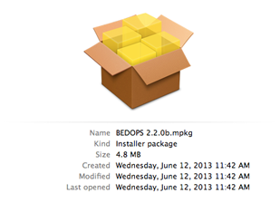
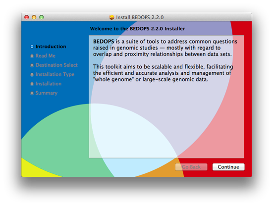

.. _installation:

Installation
============

BEDOPS is available to users as :ref:`pre-built binaries <installation_via_packages>` and :ref:`source code <installation_via_source_code>`.

.. _installation_via_packages:

======================
Via pre-built packages
======================

Pre-built binaries offer the easiest and fastest installation option for users of BEDOPS. At this time, we offer binaries for 32- and 64-bit versions of Linux and OS X (Intel) platforms.

-----
Linux
-----

1. Download the current 32- or 64-bit package for Linux from `Github BEDOPS Releases <https://github.com/bedops/bedops/releases>`_.
2. Extract the package to a location of your choice. 
   In the case of 32-bit Linux: ::

       $ tar jxvf bedops_linux_i386-vx.y.z.tar.bz2

   In the case of 64-bit Linux: ::

       $ tar jxvf bedops_linux_x86_64-vx.y.z.tar.bz2

   Replace ``x``, ``y`` and ``z`` with the version number of BEDOPS you have downloaded.
3. Copy the extracted binaries to a location of your choice which is in your environment's ``PATH``, *e.g.* ``/usr/local/bin``: ::

       $ cp bin/* /usr/local/bin

   Change this destination folder, as needed.

--------
Mac OS X
--------

1. Download the current Mac OS X package for BEDOPS from `Github BEDOPS Releases <https://github.com/bedops/bedops/releases>`_.
2. Locate the installer package (usually located in ``~/Downloads`` |--| this will depend on your web browser configuration):

3. Double-click to open the installer package. It will look something like this:

4. Follow the instructions to install BEDOPS and library dependencies to your Mac. (If you are upgrading from a previous version, components will be overwritten or removed, as needed.)

.. _installation_via_source_code:

===============
Via source code
===============

.. _installation_via_source_code_on_linux:

-----
Linux
-----

Compilation of BEDOPS on Linux requires GCC 4.8.x (both ``gcc`` and ``g++`` and related components) or greater, which includes support for `C++11 <http://en.wikipedia.org/wiki/C%2B%2B11>`_ features required by core BEDOPS tools. Other tools may be required as described in the installation documentation that follows.

1. If you do not have GCC 4.8 or greater installed (both ``gcc`` and ``g++``), first install these tools. You can check the state of your GCC installation with ``gcc --version`` and ``g++ --version``, *e.g.*: 

   ::

     $ gcc --version
     gcc (GCC) 4.8.0 20130127 (experimental)
     ...

   If you lack a compiler or have a compiler that is older than 4.8, use your favorite package manager to install or upgrade the newer package. For example, in Ubuntu, you might run the following: 

   ::
 
     $ sudo apt-get install gcc-4.8
     $ sudo apt-get install g++-4.8
     $ sudo update-alternatives --install /usr/bin/gcc gcc /usr/bin/gcc-4.8 50
     $ sudo update-alternatives --install /usr/bin/g++ g++ /usr/bin/g++-4.8 50

   The specifics of this process will depend on your distribution and what you want to install. Please check with your system administration or support staff if you are unsure what your options are.

2. Install a ``git`` client of your choice, if you do not already have one installed. Github offers an `installation guide <https://help.github.com/articles/set-up-git#platform-all>`_.

   Alternatively, use ``apt-get`` or another package manager to install one, *e.g.*

   ::

     $ sudo apt-get install git

3. Clone the BEDOPS Git repository in an appropriate local directory: 

   ::
  
     $ git clone https://github.com/bedops/bedops.git
  
4. Enter the top-level of the local copy of the BEDOPS repository and run ``make`` to begin the build process:

   ::

     $ cd bedops
     $ make

.. tip:: BEDOPS now supports parallel builds. If you are compiling on a multicore or multiprocessor workstation, use ``make -j N`` where ``N`` is ``2``, ``4`` or however many cores or processors you have, in order to parallelize and speed up the build process.

5. Once the build is complete, install compiled binaries and scripts to a local ``bin`` folder: 

   ::

     $ make install

6. Copy the extracted binaries to a location of your choice that is in your environment's ``PATH``, *e.g.* ``/usr/local/bin``: 

   ::
 
     $ cp bin/* /usr/local/bin

   Change this destination folder, as needed.

.. _installation_via_source_code_on_mac_os_x:

--------
Mac OS X
--------

In Mac OS X, you have two options to install BEDOPS via source code: Compile the code manually, or use the Homebrew package manager to manage compilation.

Compilation of BEDOPS on Mac OS X via either procedure requires Clang/LLVM 3.3 or greater, which includes support for `C++11 <http://en.wikipedia.org/wiki/C%2B%2B11>`_ features required by core BEDOPS tools. Other tools may be required as described in the installation documentation that follows. GNU GCC is no longer required for compilation on OS X hosts.

^^^^^^^^^^^^^^^^^^
Manual compilation
^^^^^^^^^^^^^^^^^^

1. If you do not have Clang/LLVM 3.3 or greater installed, first do so. You can check this with ``clang -v``, *e.g.*: 

   ::

     $ clang -v
     Apple LLVM version 5.0 (clang-500.2.79) (based on LLVM 3.3svn)
     ...

   For Mac OS X users, we recommend installing `Apple Xcode <https://developer.apple.com/xcode/>`_ and its Command Line Tools, via the ``Preferences > Downloads`` option within Xcode. At the time of this writing, Xcode 5.0.2 includes the necessary command-line tools to compile BEDOPS.

2. Install a ``git`` client of your choice, if you do not already have one installed. Github offers an `installation guide <https://help.github.com/articles/set-up-git#platform-all>`_.

3. Clone the BEDOPS Git repository in an appropriate local directory: 

   ::
  
     $ git clone https://github.com/bedops/bedops.git
  
4. Run ``make build_all_darwin_intel_fat`` in the top-level of the local copy of the BEDOPS repository:

   ::

     $ cd bedops
     $ make

.. tip:: BEDOPS now supports parallel builds. If you are compiling on a multicore or multiprocessor workstation, use ``make -j N`` where ``N`` is ``2``, ``4`` or however many cores or processors you have, in order to parallelize and speed up the build process.

5. Once the build is complete, install compiled binaries and scripts to a local ``bin`` folder: 

   ::

     $ make install

6. Copy the extracted binaries to a location of your choice that is in your environment's ``PATH``, *e.g.* ``/usr/local/bin``: 

   ::
 
     $ cp bin/* /usr/local/bin

   Change this destination folder, as needed.

^^^^^^^^^^^^^^^^^^^^^^^^
Compilation via Homebrew
^^^^^^^^^^^^^^^^^^^^^^^^

Homebrew is a popular package management toolkit for Mac OS X. It facilitates easy installation of common scientific and other packages.

1. If you do not have Clang/LLVM 3.3 or greater installed, first do so. You can check this with ``clang -v``, *e.g.*: 

   ::

     $ clang -v
     Apple LLVM version 5.0 (clang-500.2.79) (based on LLVM 3.3svn)
     ...

   For Mac OS X users, we recommend installing `Apple Xcode <https://developer.apple.com/xcode/>`_ and its Command Line Tools, via the ``Preferences > Downloads`` option within Xcode. At the time of this writing, Xcode 5.0.2 includes the necessary command-line tools to compile BEDOPS.

2. Follow the instructions listed on the `Homebrew site <http://brew.sh>`_ to install the basic package manager components.

3. Run the following command:

   ::

     $ brew install bedops

.. _installation_via_source_code_on_cygwin:

------
Cygwin
------

1. Make sure you are running a 64-bit version of Cygwin. Compilation of BEDOPS on 32-bit versions of Cygwin is not supported.

   To be sure, open up your Cywin installer application (separate from the Cygwin terminal application) and look for the **64 bit** marker next to the setup application version number: 

   .. image:: ../assets/installation/bedops_cygwin_installer_screen.png
      :width: 99%

   For instance, this Cygwin installer is version 2.831 and is 64-bit.

2. Check that you have GCC 4.8 or greater installed. You can check this by opening the Cygwin terminal window (note that this is not the same as the Cygwin installer application) and typing ``gcc --version``, *e.g.*: 

   ::

     $ gcc --version
     gcc (GCC) 4.8.2
     ...

   If you do not have ``gcc`` installed, then open the Cygwin (64-bit) installer application again, navigate through the current setup options, and then mark the GCC 4.8.* packages for installation:

   .. image:: ../assets/installation/bedops_cygwin_installer_gcc_screen.png
      :width: 99%

   If it helps, type in ``gcc`` into the search field to filter results to GCC-related packages. Make sure to mark the following packages for installation, at least:

   * **gcc-core**
   * **gcc-debuginfo**
   * **gcc-g++**
   * **gcc-tools-xyz**
   * **libgcc1**

   Click "Next" to follow directives to install those and any other selected package items. Then run ``gcc --version`` as before, to ensure you have a working GCC setup.

3. Install a ``git`` client of your choice. You can compile one or use the precompiled ``git`` package available through the Cygwin (64-bit) installer:

   .. image:: ../assets/installation/bedops_cygwin_installer_git_screen.png
      :width: 99%

   If it helps, type in ``git`` into the search field to filter results to Git-related packages. Make sure to install the following package, at least:

   * **git**

4. In a Cygwin terminal window, clone the BEDOPS Git repository to an appropriate local directory:

   ::

     $ git clone https://github.com/bedops/bedops.git

4. Enter the top-level of the local copy of the BEDOPS repository and run ``make`` to begin the build process:

   ::

     $ cd bedops
     $ make

.. tip:: BEDOPS now supports parallel builds. If you are compiling on a multicore or multiprocessor workstation, use ``make -j N`` where ``N`` is ``2``, ``4`` or however many cores or processors you have, in order to parallelize and speed up the build process.

5. Once the build is complete, install compiled binaries and scripts to a local ``bin`` folder: 

   ::

     $ make install

6. Copy the extracted binaries to a location of your choice that is in your environment's ``PATH``, *e.g.* ``/usr/bin``: 

   ::
 
     $ cp bin/* /usr/bin

   Change this destination folder, as needed.

.. _installation_os_x_installer_construction:

=====================================================
Building an OS X installer package for redistribution
=====================================================

1. Follow steps 1-3 and step 5 from the :ref:`Via Source Code <installation_via_source_code>` documentation.

2. Run ``make install_osx_packaging_bins`` in the top-level of the local copy of the BEDOPS repository:

   ::

     $ make install_osx_packaging_bins

3. Install `WhiteBox Packages.app <http://s.sudre.free.fr/Software/Packages/about.html>`_, an application for building OS X installers, if not already installed.

4. Create a ``build`` directory to store the installer and open the ``BEDOPS.pkgproj`` file in the top-level of the local copy of the BEDOPS repository, in order to open the BEDOPS installer project, *e.g.*:

   ::
     
     $ mkdir packaging/os_x/build && open packaging/os_x/BEDOPS.pkgproj

   This will open up the installer project with the ``Packages.app`` application.

5. Within ``Packages.app``, modify the project to include the current project version number or other desired changes, as applicable.

6. Run the ``Build > Build`` menu selection to construct the installer package, located in the ``packaging/os_x/build`` subdirectory. Move this installer to the desired location with ``mv`` or the OS X Finder.

.. |--| unicode:: U+2013   .. en dash
.. |---| unicode:: U+2014  .. em dash, trimming surrounding whitespace
   :trim:
