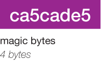
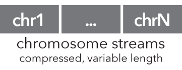
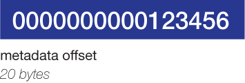
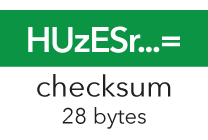

.. _starch_specification:

Starch (v2) specification
=========================

This document describes the specification for a "Starch v2"-formatted archive, which is created by the :ref:`starch` and :ref:`starchcat` utilities and extracted with the :ref:`unstarch` utility.

=================
Archive structure
=================

A Starch v2 archive is divided up into six portions:

Each portion is explained below.

===========
Magic bytes
===========

We use four ``unsigned char`` bytes ``ca5cade5`` to identify the file as a Starch v2 archive. BEDOPS utilities and applications which process Starch archives search for these magic bytes at the start of the file to identify it as a v2 archive.

If the file does not have these bytes, it may still be a legacy (v1, v1.2 or v1.5) Starch archive, which is identified and processed by other means not described in this document.

==================
Chromosome streams
==================

These variable-length data streams contain compressed, transformed BED data separated by chromosome.

Transformation is performed on BED input to remove redundancy in the coordinate data provided in the second and third columns ("start" and "stop" coordinates). Data in any additional columns are left unchanged. Transformed data are highly reduced and compressed further with open-source ``bzip2`` or ``gzip`` libraries.

Starch v2 streams extracted with :ref:`unstarch`, :ref:`bedops`, :ref:`bedmap` or :ref:`closest-features` are uncompressed with the requisite backend compression library calls and then reverse-transformed to recover the original BED input.

========
Metadata
========

The archive metadata is made up of data, offset and hash components, each with different characteristics as described below.

----
Data
----

This variable-length portion of the archive is a `JSON <http://www.json.org/>`_ -formatted ASCII string that describes the Starch archive contents. We choose JSON as it provides a human-readable structure, allows easier extensibility for future revisions of BEDOPS and is a common format in web services, facilitating usage with web- and command-line-based bioinformatics pipelines.

The format of a typical Starch v2 JSON object is made up of two key-value pairs, one for archive and the second for streams, which we describe in greater detail below.

^^^^^^^
Archive
^^^^^^^

The archive key scheme is described below:

::

  {
    "archive": {
      "type": "starch",
      "customUCSCHeaders": (Boolean),
      "creationTimestamp": (string),
      "version": { "major": 2, "minor": 0, "revision": 0 },
      "compressionFormat": (unsigned integer),
      "note": (string, optional)
    },
    ...
  }

At this time, the ``type`` key will specify ``starch``.

The ``customUCSCHeaders`` value is either ``true`` or ``false``. If ``true``, the ``--header`` option was provided to :ref:`starch` when the archive was created, and the archive may likely contain `UCSC headers <http://genome.ucsc.edu/FAQ/FAQformat.html#format1.7>`_ commonly encountered with UCSC Genome Browser data downloads. Archives created with :ref:`starchcat` do not support UCSC headers (*i.e.*, this value is false in archives created with :ref:`starchcat`).

The ``creationTimestamp`` value is an `ISO 8601 <http://en.wikipedia.org/wiki/ISO-8601>`_ string that specifies the creation date and time of the archive. Most scripting and programming languages can parse ISO 8601-formatted date strings with little or no extra work.

The version is a triplet of integer values specifying the version of the archive. For a v2 archive, the major version will be set to ``2``. Major, minor and revision values need not necessarily be the identical to the version of the :ref:`starch` binary used to create the archive.

The ``compressionFormat`` key specifies the backend compression format used for the chromosome streams contained within the archive. We currently use ``0`` to specify ``bzip2`` and ``1`` to specify ``gzip``. No other backend formats are available at this time.

The ``note`` key is an optional string that can contain information if the ``--note="abc..."`` option is provided to :ref:`starch` when the archive is created. If this option is not specified at creation time, this key will not be present in the metadata.

^^^^^^^
Streams
^^^^^^^

------
Offset
------

----
Hash
----

=======
Padding
=======

.. |--| unicode:: U+2013   .. en dash
.. |---| unicode:: U+2014  .. em dash, trimming surrounding whitespace
   :trim:
