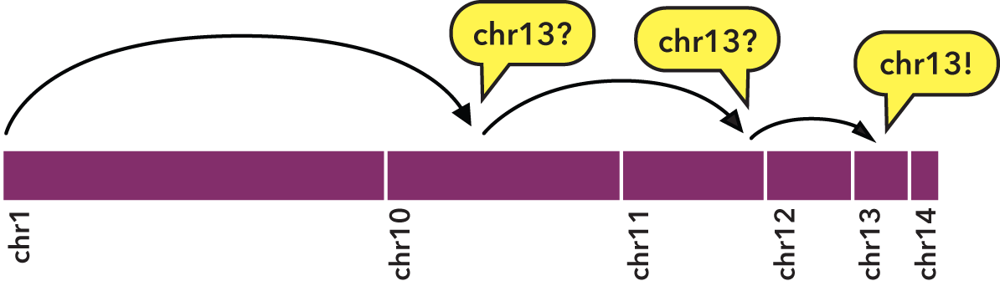

.. _bedextract:

`bedextract`
============

The ``bedextract`` utility performs three primary tasks, with the goal of doing them very quickly:

1. Lists all the chromosomes in a sorted input BED file.
2. Extracts all the elements in a sorted input BED file, for a given chromosome.
3. Finds elements of one BED file, which overlap elements in a second, reference BED file (when specific element criteria are satisfied).

One might ask why use this utility, when the first two tasks can already be performed with common UNIX text processing tools, such as ``cut``, ``sort``, ``uniq``, and ``awk``, and the third task can be performed with :ref:`bedops` with the ``--element-of 1`` options?

The ``bedextract`` utility does the work of all those tools without streaming through an entire BED file, resulting in massive performance improvements. By using the hints provided by sorted BED input, the :ref:`bedextract` tool can jump around, seeking very quick answers to these questions about your data.

============
How it works
============

Specifically, sorting with :ref:`sort-bed` allows us to perform a `binary search <http://en.wikipedia.org/wiki/Binary_search_algorithm>`_: 

1. We jump to the middle byte of the BED file, stream to the nearest element, then parse and test the chromosome name. 
2. Either we have a match, or we jump to the middle of the remaining left or right half (decided by dictionary order), parse and test again. 
3. We repeat steps 1 and 2 until we have matches that define the bounds of the target chromosome.

To indicate the kind of speed gain that the :ref:`bedextract` tool provides, in local testing, a naïve listing of chromosomes from a 36 GB BED input using UNIX ``cut`` and ``uniq`` utilities took approximately 20 minutes to complete on a typical Core 2 Duo-based Linux workstation. Retrieval of the same chromosome listing with ``bedextract --list-chr`` took only 2 seconds (cache flushed |---| no cheating!).

.. tip:: While listing chromosomes is perhaps a trivial task, 1200 seconds to 2 seconds is a **600-fold** speedup. Similar improvements are gained from using ``--chrom`` and ``--faster`` options with other core BEDOPS tools like :ref:`bedops` and :ref:`bedmap`. If your data meet the criteria for using this approach |---| and a lot of genomic datasets do |---| we strongly encourage adding this to your toolkit.

==================
Inputs and outputs
==================

-----
Input
-----

Depending on specified options, :ref:`bedextract` requires one or two :ref:`sorted <sort-bed>` BED files.

.. note:: It is critical that inputs are :ref:`sorted <sort-bed>` as the information in a sorted file allows :ref:`bedextract` to do its work correctly. If your datasets are output from other BEDOPS tools, then they are already sorted!

------
Output
------

Depending on specified options, the :ref:`bedextract` program will send a list of chromosomes or BED elements to standard output. 

.. tip:: The use of UNIX-like standard streams allows easy downstream analysis or post-processing with other tools and scripts, including other BEDOPS utilities.

=====
Usage
=====

The ``--help`` option describes the functionality available to the end user:

::

  bedextract
    citation: http://bioinformatics.oxfordjournals.org/content/28/14/1919.abstract
    version:  2.4.39 (typical)
    authors:  Shane Neph & Alex Reynolds

      Every input file must be sorted per sort-bed.

   USAGE:
     0) --help or --version           Print requested info and exit successfully.
     1) --list-chr <input.bed>        Print all unique chromosome names found in <input.bed>.
     2) <chromosome> <input.bed>      Retrieve all rows for chr8 with:  bedextract chr8 <input.bed>.
     3) <query.bed> <target>          Grab elements from the <query.bed> that overlap elements in <target>. Same as
                                       `bedops -e 1 <query.bed> <target>`, except that this option fails silently
                                        if <query.bed> contains fully-nested BED elements.  If no fully-nested
                                        element exists, bedextract can vastly improve upon the performance of bedops.
                                        <target> may be a BED or Starch file (with or without fully-nested elements).
                                        Using '-' for <target> indicates input (in BED format) comes from stdin.

-------------------
Listing chromosomes
-------------------

Use the ``--list-chr`` option to quickly retrieve a listing of chromosomes from a given sorted BED input. 

For example, the following lists the chromosomes in an example BED file of FIMO motif hits (see the :ref:`Downloads <bedextract_downloads>` section):

::

  $ bedextract --list-chr motifs.bed
  chr1
  chr10
  chr11
  chr12
  ...
  chr9
  chrX

.. note:: The ``bedextract --list-chr`` operation only works on BED files. If you have a Starch file, use ``unstarch --list-chr`` to list its chromosomes.

----------------------------------------------
Retrieving elements from a specific chromosome
----------------------------------------------

To quickly retrieve the subset of elements from a sorted BED file associated with a given chromosome, apply the second usage case and specify the chromosome as the argument. 

For example, to retrieve ``chrX`` from the same motif sample:

::

  $ bedextract chrX motifs.bed
  chrX    6775077 6775092 +V_SPZ1_01      4.92705e-06     +       GTTGGAGGGAAGGGC
  chrX    6775168 6775179 +V_ELF5_01      8.57585e-06     +       TCAAGGAAGTA
  chrX    6777790 6777799 +V_CKROX_Q2     8.90515e-06     +       TCCCTCCCC
  ...

.. note:: The ``bedextract <chromosome>`` operation only works on BED files. If you have a Starch file, use ``unstarch <chromosome>`` to list the elements associated with that chromosome.

-------------------------------------------------
Retrieving elements which overlap target elements
-------------------------------------------------

A common :ref:`bedops` query involves asking which elements overlap one or more bases between two BED datasets, which we will call here ``Query`` and ``Target``. 

One can already use ``bedops --element-of 1`` to accomplish this task, but if certain specific criteria are met (which we will describe shortly) then a much faster result can often be obtained by instead using :ref:`bedextract`. 

Three criteria make the use of :ref:`bedextract` in this mode very successful in practice, with potentially massive speed improvements:

1. ``Query`` is a huge file.
2. There are relatively few regions of interest in ``Target`` (say, roughly 30,000 or fewer).
3. There are **no fully-nested elements** in ``Query`` (but duplicate coordinates are fine).

.. note:: With some extra work, it is possible to use this mode of bedextract with a huge ``Query`` BED file that includes fully-nested elements.  The technique requires that you create a merged version of ``Query`` and keep that result, ``Query-Index``, around along with ``Query``.

::

  $ bedops -m Query > Query-Index
  $ bedextract Query-Index Target \
      | bedextract Query - \
      | bedops --element-of 1 - Target \
      > answer.bed

.. note:: You may change the final overlap criterion to the `bedops --element-of` as you see fit for your final answer.  Adding --range 10, for example, to `bedops -m Query > Query-Index` can often greatly reduce the size of Query-Index without much of an increase in the running time of this approach.

.. _bedextract_nested_elements:

^^^^^^^^^^^^^^^^^^^^^^^^^
What are nested elements?
^^^^^^^^^^^^^^^^^^^^^^^^^

For a precise definition of a nested element, refer to the :ref:`documentation on nested elements <nested_elements>`.

For an example, we show the following sorted BED file:

::

  chr1    1      100
  chr1    100    200
  chr1    125    150
  chr1    150    1000

In this sorted dataset, the element ``chr1:125-150`` is entirely nested within ``chr1:100-200``:

.. image:: ../../../assets/reference/set-operations/reference_bedextract_nested_elements.png
   :width: 99%

.. note::  Fully-nested elements are not a problem for the other two :ref:`bedextract` features: 1) Listing all chromosomes, and 2) Retrieving all information for a single chromosome.

Fully-nested elements are only an issue for :ref:`bedextract` if they exist in the ``Query`` dataset. Results are not affected if the ``Target`` dataset contains nested elements. Overlapping (but not fully-nested) elements in the ``Query`` input file are fine, as are duplicated genomic positions.

.. note:: Our lab works with BED data of various types: cut-counts, hotspots, peaks, footprints, etc. These data generally do not contain nested elements and so are amenable to use with :ref:`bedextract` for extracting overlapping elements.

   However, other types of ``Query`` datasets can be problematic. FIMO search results, for example, might cause trouble, where the boundaries of one motif hit can be contained within another larger hit. Or paired-end sequence data, where tags are not of a fixed length. Be sure to consider the makeup of your BED data before using :ref:`bedextract`.

^^^^^^^^^^^^^
Demonstration
^^^^^^^^^^^^^

To demonstrate this use of :ref:`bedextract`, for our ``Query`` dataset we will use the ``Map`` example from our :ref:`bedmap` documentation, which contains raw DNaseI hypersensitivity signal from a human K562 cell line (see the :ref:`Downloads <bedextract_downloads>` section for sample data):

::
 
  $ cat query.bed
  chr21   33031165        33031185        map-1   1.000000
  chr21   33031185        33031205        map-2   3.000000
  chr21   33031205        33031225        map-3   3.000000
  chr21   33031225        33031245        map-4   3.000000
  ...
  chr21   33032445        33032465        map-65  5.000000
  chr21   33032465        33032485        map-66  6.000000

Our ``Target`` data is simply an *ad-hoc* BED region which overlaps part of the ``Query`` dataset, stored in a :ref:`Starch-formatted <starch>` archive:

::

  $ unstarch target.starch
  chr21   33031600        33031700

We can now ask which elements of ``Query`` overlap the element in ``Target``:

::

  $ bedextract query.bed target.starch
  chr21   33031585        33031605        map-22  26.000000
  chr21   33031605        33031625        map-23  27.000000
  chr21   33031625        33031645        map-24  29.000000
  chr21   33031645        33031665        map-25  31.000000
  chr21   33031665        33031685        map-26  31.000000
  chr21   33031685        33031705        map-27  37.000000

Our ``Target`` dataset is a Starch-formatted file. Note that we can also use "-" to denote standard input for the ``Target`` dataset, as well as a regular BED- or Starch-formatted file. In other words, we can pipe target elements from another process to :ref:`bedextract`, *e.g.* we can query for an ad-hoc element as follows:

::

  $ echo -e "chr21\t33031590\t33031600" | bedextract query.bed -
  chr21   33031585        33031605        map-22  26.000000

Instead of an *ad-hoc* element as in this example, however, target elements could just as easily be piped in from upstream :ref:`bedmap` or :ref:`bedops` operations, or extracted elements from a Starch archive, etc. 

.. tip:: The output of this particular use of :ref:`bedextract` is made up of elements from the ``Query`` dataset and is therefore :ref:`sorted <sort-bed>` BED data, which can be piped to :ref:`bedops`, :ref:`bedmap` and other BEDOPS utilities for further downstream processing.

.. note:: Though :ref:`bedextract` only supports the overlap equivalent of ``bedops --element-of 1``, other overlap criteria are efficiently supported by combining :ref:`bedextract` with :ref:`bedops`. 

   Specifically, we can quickly filter through just the results given by :ref:`bedextract` and implement other overlap criteria with :ref:`bedops`, *e.g.*:

   ``$ bedextract query.bed target.bed | bedops -e 50% - target.bed``

.. _bedextract_downloads:

=========
Downloads
=========

* Sample :download:`FIMO motifs <../../../assets/reference/set-operations/reference_bedextract_motifs.bed>`
* Sample ``Query`` dataset: :download:`DHS signal <../../../assets/reference/statistics/reference_bedmap_map.bed>`
* Sample ``Target`` dataset: :download:`ad-hoc coordinates <../../../assets/reference/set-operations/reference_bedextract_target.starch>`

.. |--| unicode:: U+2013   .. en dash
.. |---| unicode:: U+2014  .. em dash, trimming surrounding whitespace
   :trim:
