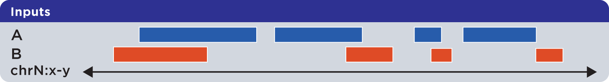
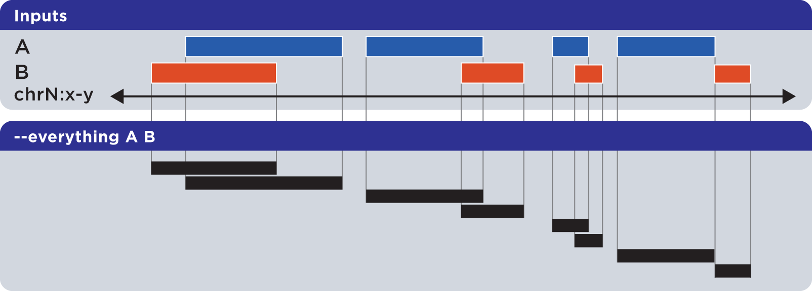
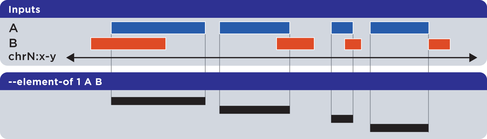
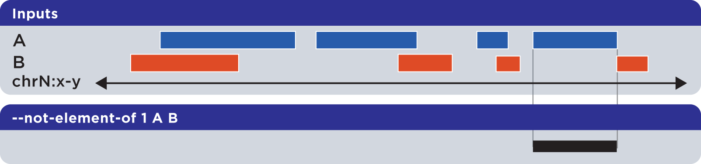
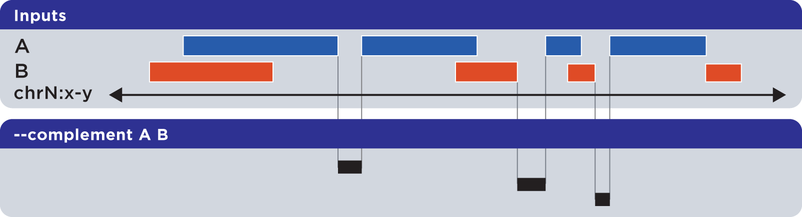
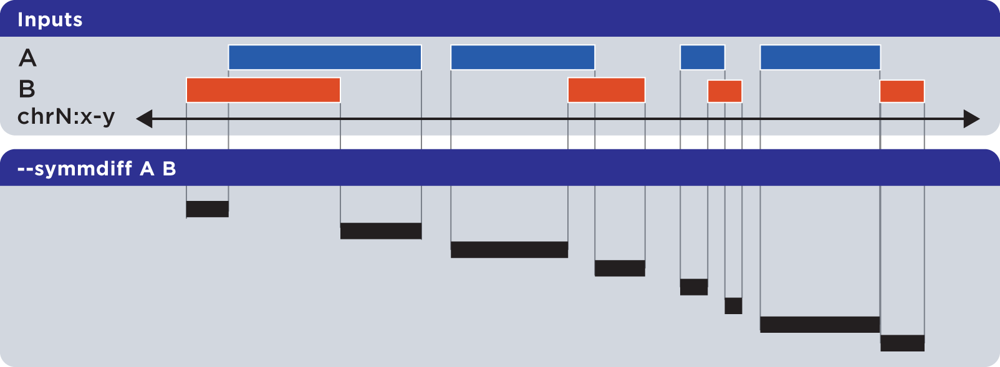
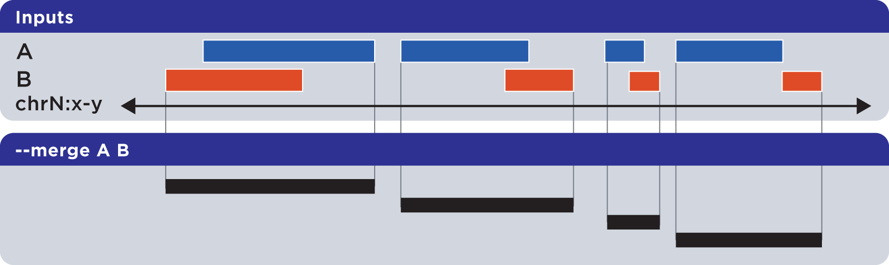
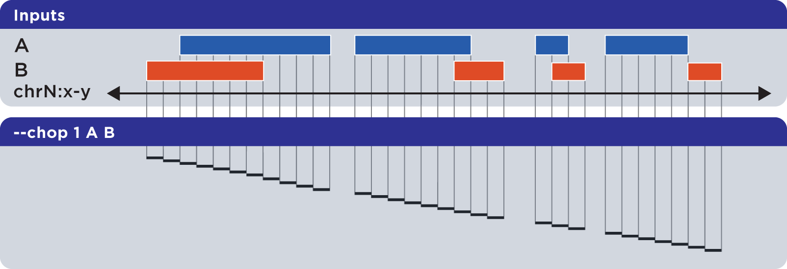
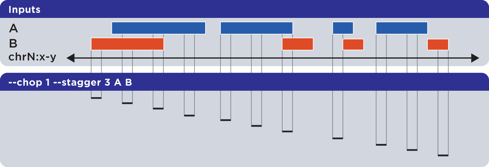

.. _bedops:

`bedops`
========

``bedops`` is a core tool for finding relationships between two or more genomic datasets.

This is an important category of problems to solve. As examples, one might want to:

* Know how much overlap exists between the elements of two datasets, to quantitatively establish the degree to which they are similar.
* Merge or filter elements. For example, retrieving non-overlapping, "unique" elements from multiple BED files.
* Split elements from multiple BED files into disjoint subsets.

The :ref:`bedops` program offers several Boolean set and multiset operations, including union, subset, and difference, to assist investigators with answering these types of questions. 

Importantly, :ref:`bedops` handles any number of any-size inputs at once when computing results in order to maximize efficiency. This use case has :ref:`serious practical consequences <multiple_inputs>` for many genomic studies.

One can also use :ref:`bedops` to symmetrically or asymmetrically pad coordinates.

==================
Inputs and outputs
==================

-----
Input
-----

The :ref:`bedops` program reads :ref:`sorted <sort-bed>` BED data and BEDOPS :ref:`Starch-formatted <starch>` archives as input.

Finally, :ref:`bedops` requires specification of a set operation (and, optionally, may include modifier options).

Support for common headers (including UCSC track headers) is offered through the ``--header`` option. Headers are stripped from output.

------
Output
------

The :ref:`bedops` program returns :ref:`sorted <sort-bed>` BED results to standard output. This output can be redirected to a file or piped to other utilities.

=====
Usage
=====

The :ref:`bedops` program takes sorted BED-formatted data as input, either from a file or streamed from standard input. It will process any number of input files in parallel.

If your data are unsorted, use BEDOPS :ref:`sort-bed` to prepare data for :ref:`bedops`. You only need to sort once, as all BEDOPS tools read and write sorted BED data.

Because memory usage is very low, one can use sorted inputs of any size. Processing times generally follow a simple linear relationship with input sizes (*e.g.*, as the input size doubles, the processing time doubles accordingly).

The ``--help`` option describes the set operation and other options available to the end user: 

::

  bedops
    citation: http://bioinformatics.oxfordjournals.org/content/28/14/1919.abstract
    version:  2.4.39 (typical)
    authors:  Shane Neph & Scott Kuehn

        USAGE: bedops [process-flags] <operation> <File(s)>*

            Every input file must be sorted per the sort-bed utility.
            Each operation requires a minimum number of files as shown below.
              There is no fixed maximum number of files that may be used.
            Input files must have at least the first 3 columns of the BED specification.
            The program accepts BED and Starch file formats.
            May use '-' for a file to indicate reading from standard input (BED format only).

        Process Flags:
            --chrom <chromosome> Process data for given <chromosome> only.
            --ec                 Error check input files (slower).
            --header             Accept headers (VCF, GFF, SAM, BED, WIG) in any input file.
            --help               Print this message and exit successfully.
            --help-<operation>   Detailed help on <operation>.
                                   An example is --help-c or --help-complement
            --range L:R          Add 'L' bp to all start coordinates and 'R' bp to end
                                   coordinates. Either value may be + or - to grow or
                                   shrink regions.  With the -e/-n operations, the first
                                   (reference) file is not padded, unlike all other files.
            --range S            Pad or shink input file(s) coordinates symmetrically by S.
                                   This is shorthand for: --range -S:S.
            --version            Print program information.

        Operations: (choose one of)
            -c, --complement [-L] File1 [File]*
            -d, --difference ReferenceFile File2 [File]*
            -e, --element-of [number% | number] ReferenceFile File2 [File]*
                   by default, -e 100% is used.  'bedops -e 1' is also popular.
            -i, --intersect File1 File2 [File]*
            -m, --merge File1 [File]*
            -n, --not-element-of [number% | number] ReferenceFile File2 [File]*
                   by default, -n 100% is used.  'bedops -n 1' is also popular.
            -p, --partition File1 [File]*
            -s, --symmdiff File1 File2 [File]*
            -u, --everything File1 [File]*
            -w, --chop [bp] [--stagger [bp]] [-x] File1 [File]*
                   by default, -w 1 is used with no staggering.

        Example: bedops --range 10 -u file1.bed
        NOTE: Only operations -e|n|u preserve all columns (no flattening)

.. note:: Extended help is available for all operations in :ref:`bedops`. For example, the ``--help-symmdiff`` option in :ref:`bedops` gives detailed information on the ``--symmdiff`` operation.

==========
Operations
==========

To demonstrate the various operations in :ref:`bedops`, we start with two simple datasets ``A`` and ``B``, containing genomic elements on generic chromsome ``chrN``:

These datasets can be :ref:`sorted <sort-bed>` BED or :ref:`Starch-formatted <starch>` files or streams.

.. note:: The :ref:`bedops` tool can operate on two or more multiple inputs, but we show here the results of operations acting on just two or three sets, in order to help demonstrate the basic principles of applying set operations.

.. _bedops_everything:

-----------------------------
Everything (-u, --everything)
-----------------------------

The ``--everything`` option is equivalent to concatenating and sorting BED elements from multiple files, but works much faster:

As with all BEDOPS tools and operations, the output of this operation is :ref:`sorted <sort-bed>`.

.. note:: The ``--everything`` option preserves all columns from all inputs. This is useful for multiset unions of datasets with additional ID, score or other metadata.

.. admonition:: Example
   :class: admonition-example

   To demonstrate the use of ``--everything`` in performing a multiset union, we show three sorted sets ``First.bed``, ``Second.bed`` and ``Third.bed`` and the result of their union with ``bedops``:
 
   .. code:: bash

      $ more First.bed
      chr1	100	200
      chr2	150	300
      chr2	200	250
      chr3      100     150

   .. code:: bash

      $ more Second.bed
      chr2	50	150
      chr2	400	600

   .. code:: bash

      $ more Third.bed
      chr3	150	350

   .. code:: bash
      
      $ bedops --everything First.bed Second.bed Third.bed > Result.bed

   .. code:: bash
      
      $ more Result.bed
      chr1	100	200
      chr2	50	150
      chr2	150	300
      chr2	200	250
      chr2	400	600
      chr3      100     150
      chr3	150	350

   This example uses three input sets, but you can specify two, four or even more sets with ``--everything`` to take their union.

.. _bedops_element_of:

-----------------------------
Element-of (-e, --element-of)
-----------------------------

The ``--element-of`` operation shows the elements of the first ("*reference*") file that overlap elements in the second and subsequent "*query*" files by the specified length (in bases) or by percentage of length.

In the following example, we search for elements in the reference set ``A`` which overlap elements in query set ``B`` by at least one base:

Elements that are returned are always from the reference set (in this case, set ``A``).

.. note:: The ``--element-of`` option preserves all columns from the first (reference) input.

.. admonition:: Example
   :class: admonition-example

   The argument to ``--element-of`` is a value that species to degree of overlap for elements. The value is either integral for per-base overlap,  or fractional for overlap measured by length.

   Here is a demonstration of the use of ``--element-of 1`` on two sorted sets ``First.bed`` and ``Second.bed``, which looks for elements in the ``First`` set that overlap elements in the ``Second`` set by one or more bases:
 
   .. code:: bash

      $ more First.bed
      chr1	100	200
      chr1	150	160
      chr1	200	300
      chr1	400	475
      chr1	500	550

   .. code:: bash

      $ more Second.bed
      chr1	120	125
      chr1	150	155
      chr1	150	160
      chr1	460	470
      chr1	490	500

   .. code:: bash
      
      $ bedops --element-of 1 First.bed Second.bed > Result.bed

   .. code:: bash
      
      $ more Result.bed
      chr1	100	200
      chr1	150	160
      chr1	400	475

   One base is the least stringent (default) integral criterion. We can be more restrictive about our overlap requirement by increasing this value, say to 15 bases:

   .. code:: bash
      
      $ bedops --element-of 15 First.bed Second.bed > Result.bed

   .. code:: bash
      
      $ more Result.bed
      chr1	100	200

   Only this element from the ``First`` set overlaps one or more elements in the ``Second`` set by a total of fifteen or more bases.

   We can also use percentage of overlap as our argument. Let's say that we only want elements from the ``First`` set, which overlap half their length or more of a qualifying element in the ``Second`` set:

   .. code:: bash

      $ bedops --element-of 50% First.bed Second.bed > Result.bed

   .. code:: bash
      
      $ more Result.bed
      chr1	150	160

Note that `--element-of` is *not* a symmetric operation, as demonstrated by reversing the order of the reference and query set:

.. image:: ../../../assets/reference/set-operations/reference_setops_bedops_elementof_ba@2x.png
   :width: 99%

.. admonition:: Example
   :class: admonition-example

   As we show here, by inverting the usual order of our sample sets ``First`` and ``Second``, we retrieve elements from the ``Second`` set:
 
   .. code:: bash

      $ bedops --element-of 1 Second.bed First.bed > Result.bed

   .. code:: bash
      
      $ more Result.bed
      chr1	120	125
      chr1	150	155
      chr1	150	160
      chr1	460	470

While this operation is not symmetric with respect to ordering of input sets, ``--element-of`` (``-e``) does produce exactly everything that ``--not-element-of`` (``-n``) does not, given the same overlap criterion and ordered input sets.

.. note:: We show usage examples with two files, but ``--element-of`` supports three or more input sets. For a more in-depth discussion of ``--element-of`` and how overlaps are determined with three or more input files, please review the `BEDOPS forum discussion <http://bedops.uwencode.org/forum/index.php?topic=20.0>`_ on this subject.

.. _bedops_not_element_of:

-------------------------------------
Not-element-of (-n, --not-element-of)
-------------------------------------

The ``--not-element-of`` operation shows elements in the reference file which do not overlap elements in all other sets. For example:

.. admonition:: Example
   :class: admonition-example

   We again use sorted sets ``First.bed`` and ``Second.bed`` to demonstrate ``--not-element-of``, in order to look for elements in the ``First`` set that *do not* overlap elements in the ``Second`` set by one or more bases:
 
   .. code:: bash

      $ more First.bed
      chr1	100	200
      chr1	150	160
      chr1	200	300
      chr1	400	475
      chr1	500	550

   .. code:: bash

      $ more Second.bed
      chr1	120	125
      chr1	150	155
      chr1	150	160
      chr1	460	470
      chr1	490	500

   .. code:: bash
      
      $ bedops --not-element-of 1 First.bed Second.bed > Result.bed

   .. code:: bash
      
      $ more Result.bed
      chr1	200	300
      chr1	500	550

As with the ``--element-of`` (``-e``) operator, the overlap criterion for ``--not-element-of`` (``-n``) can be specified either by length in bases, or by percentage of length. 

Similarly, this operation is not symmetric |--| the order of inputs will specify the reference set, and thus the elements in the result (if any).

.. note:: The ``--not-element-of`` operatior preserves columns from the first (reference) dataset.

.. note:: The same caveat applies to use of ``--not-element-of`` (``-n``) as with ``--element-of`` (``-e``), namely that the second and all subsequent input files are merged before the set operation is applied. Please review the BEDOPS `forum discussion thread <http://bedops.uwencode.org/forum/index.php?topic=20.0>`_ on this topic for more details.

.. _bedops_complement:

-----------------------------
Complement (-c, --complement)
-----------------------------

The ``--complement`` operation calculates the genomic regions in the gaps between the contiguous per-chromosome ranges defined by one or more inputs. The following example shows the use of two inputs:

Note this **computed result** will lack ID, score and other columnar data other than the first three columns that contain positional data. That is, computed elements will not come from any of the input sets, but are new elements created from the input set space.

.. admonition:: Example
   :class: admonition-example

   To demonstrate ``--complement``, we again use sorted sets ``First.bed`` and ``Second.bed``, in order to compute the "gaps" between their inputs:
 
   .. code:: bash

      $ more First.bed
      chr1	100	200
      chr1	150	160
      chr1	200	300
      chr1	400	475
      chr1	500	550

   .. code:: bash

      $ more Second.bed
      chr1	120	125
      chr1	150	155
      chr1	150	160
      chr1	460	470
      chr1	490	500

   .. code:: bash
      
      $ bedops --complement First.bed Second.bed > Result.bed

   .. code:: bash
      
      $ more Result.bed
      chr1	300	400
      chr1	475	490

   As we see here, for a given chromosome, gaps are computed between the leftmost and rightmost edges of elements in the union of elements across all input sets.

.. note:: For a more in-depth discussion on using ``--complement`` with left and right bounds of input chromosomes, please review the BEDOPS `forum discussion <http://bedops.uwencode.org/forum/index.php?topic=19.0>`_ on this subject.

.. _bedops_difference:

-----------------------------
Difference (-d, --difference)
-----------------------------

The ``--difference`` operation calculates the genomic regions found within the first (reference) input file, excluding regions in all other input files:

.. image:: ../../../assets/reference/set-operations/reference_setops_bedops_difference_ab@2x.png
   :width: 99%

.. admonition:: Example
   :class: admonition-example

   To demonstrate ``--difference``, we use sorted sets ``First.bed`` and ``Second.bed`` and compute the genomic space in ``First`` that excludes (or "subtracts") ranges from ``Second``:
 
   .. code:: bash

      $ more First.bed
      chr1	100	200
      chr1	150	160
      chr1	200	300
      chr1	400	475
      chr1	500	550

   .. code:: bash

      $ more Second.bed
      chr1	120	125
      chr1	150	155
      chr1	150	160
      chr1	460	470
      chr1	490	500

   .. code:: bash
      
      $ bedops --difference First.bed Second.bed > Result.bed

   .. code:: bash
      
      $ more Result.bed
      chr1	100	120
      chr1	125	150
      chr1	160	300
      chr1	400	460
      chr1	470	475
      chr1	500	550

.. note:: As with ``--element-of`` and ``--not-element-of``, this operation is not symmetric. While ``--not-element-of`` preserves all columns of elements found in the reference input and allows one to define overlaps, the ``--difference`` operator simply reports every genomic range as three-column BED, which does not overlap elements found in the second and subsequent input files by any amount.

.. _bedops_symmetric_difference:

-------------------------------------
Symmetric difference (-s, --symmdiff)
-------------------------------------

The ``--symmdiff`` operation calculates the genomic range that is exclusive to each input, excluding any ranges shared across inputs:

.. admonition:: Example
   :class: admonition-example

   To demonstrate ``--symmdiff``, we use sorted sets ``First.bed`` and ``Second.bed`` and compute the genomic space that is unique to ``First`` and ``Second``:
 
   .. code:: bash

      $ more First.bed
      chr1	100	200
      chr1	150	160
      chr1	200	300
      chr1	400	475
      chr1	500	550

   .. code:: bash

      $ more Second.bed
      chr1	120	125
      chr1	150	155
      chr1	150	160
      chr1	460	470
      chr1	490	500

   .. code:: bash
      
      $ bedops --symmdiff First.bed Second.bed > Result.bed

   .. code:: bash
      
      $ more Result.bed
      chr1	100	120
      chr1	125	150
      chr1	160	300
      chr1	400	460
      chr1	470	475
      chr1	490	550

.. tip:: It has been observed that ``--symmdiff`` (``-s``) is the same as the union of ``--difference A B`` with ``--difference B A``, but ``--symmdiff`` runs faster in practice.

.. _bedops_intersect:

---------------------------
Intersect (-i, --intersect)
---------------------------

The ``--intersect`` operation determines genomic regions common to all input sets:

.. image:: ../../../assets/reference/set-operations/reference_setops_bedops_intersect_ab@2x.png
   :width: 99%

.. admonition:: Example
   :class: admonition-example

   To demonstrate ``--intersect``, we use sorted sets ``First.bed`` and ``Second.bed`` and compute the genomic space that is common to both ``First`` and ``Second``:
 
   .. code:: bash

      $ more First.bed
      chr1	100	200
      chr1	150	160
      chr1	200	300
      chr1	400	475
      chr1	500	550

   .. code:: bash

      $ more Second.bed
      chr1	120	125
      chr1	150	155
      chr1	150	160
      chr1	460	470
      chr1	490	500

   .. code:: bash
      
      $ bedops --intersect First.bed Second.bed > Result.bed

   .. code:: bash
      
      $ more Result.bed
      chr1	120	125
      chr1	150	160
      chr1	460	470

   Notice how this computed result is quite different from that of ``--element-of N``, which functions more like a LEFT JOIN operation in SQL.

.. _bedops_merge:

-------------------
Merge (-m, --merge)
-------------------

The ``--merge`` operation flattens all disjoint, overlapping, and adjoining element regions into contiguous, disjoint regions:

.. admonition:: Example
   :class: admonition-example

   To demonstrate ``--merge``, we use sorted sets ``First.bed`` and ``Second.bed`` and compute the contiguous genomic space across both ``First`` and ``Second``:
 
   .. code:: bash

      $ more First.bed
      chr1	100	200
      chr1	150	160
      chr1	200	300
      chr1	400	475
      chr1	500	550

   .. code:: bash

      $ more Second.bed
      chr1	120	125
      chr1	150	155
      chr1	150	160
      chr1	460	470
      chr1	490	500

   .. code:: bash
      
      $ bedops --merge First.bed Second.bed > Result.bed

   .. code:: bash
      
      $ more Result.bed
      chr1	100	300
      chr1	400	475
      chr1	490	550

.. tip:: The preceding example shows use of ``--merge`` (``-m``) with two inputs, but the merge operation works just as well with one input, collapsing elements within the file that overlap or which are directly adjoining.

.. _bedops_partition:

---------------------------
Partition (-p, --partition)
---------------------------

The ``--partition`` operator splits all overlapping input regions into a set of disjoint segments. One or more input files may be provided; this option will segment regions from all inputs:

.. image:: ../../../assets/reference/set-operations/reference_setops_bedops_partition_ab@2x.png
   :width: 99%

.. admonition:: Example
   :class: admonition-example

   To demonstrate ``--partition``, we use sorted sets ``First.bed`` and ``Second.bed`` and compute disjointed genomic regions across both ``First`` and ``Second``:
 
   .. code:: bash

      $ more First.bed
      chr1	100	200
      chr1	150	160
      chr1	200	300
      chr1	400	475
      chr1	500	550

   .. code:: bash

      $ more Second.bed
      chr1	120	125
      chr1	150	155
      chr1	150	160
      chr1	460	470
      chr1	490	500

   .. code:: bash
      
      $ bedops --partition First.bed Second.bed > Result.bed

   .. code:: bash
      
      $ more Result.bed
      chr1	100	120
      chr1	120	125
      chr1	125	150
      chr1	150	155
      chr1	155	160
      chr1	160	200
      chr1	200	300
      chr1	400	460
      chr1	460	470
      chr1	470	475
      chr1	490	500
      chr1	500	550

   Notice that the result set of partitioned elements excludes any duplicates from input regions, thus enforcing the disjoint nature of the computed result.

.. note:: As with ``--merge``, ``--complement`` and other "computing" operations, note the lack of ID, score and other columnar data in this computed result.

.. _bedops_chop:

-----------------
Chop (-w, --chop)
-----------------

The ``--chop`` operator merges all overlapping input regions and "chops" them up into a set of disjoint segments of identical length (with a default of one base). One or more input files may be provided; this option will segment regions from all inputs:

.. admonition:: Example
   :class: admonition-example

   To demonstrate ``--chop``, we use a sorted set called ``Regions.bed`` and compute a set of one-base genomic regions constructed from the merged input elements:

   .. code:: bash

      $ more Regions.bed
      chr1	100	105
      chr1	120	127
      chr1	122	124

   .. code:: bash
      
      $ bedops --chop 1 Regions.bed > Result.bed

   .. code:: bash
      
      $ more Result.bed
      chr1	100	101
      chr1	101	102
      chr1	102	103
      chr1	103	104
      chr1	104	105
      chr1	120	121
      chr1	121	122
      chr1	122	123
      chr1	123	124
      chr1	124	125
      chr1	125	126
      chr1	126	127

.. note:: Overlapping and nested regions are merged into contiguous ranges before chopping. The end result contains unique, non-overlapping elements.

.. _bedops_stagger:

-------------------
Stagger (--stagger)
-------------------

The ``--stagger`` operator works in conjunction with :ref:`--chop <bedops_chop>`. While ``--chop`` sets the size of each cut, the ``--stagger`` operator moves the start position of each cut by the specified number of bases, across each merged interval.

.. admonition:: Example
   :class: admonition-example

   To demonstrate ``--stagger``, we use a sorted set called ``Regions.bed`` and compute a set of one-base genomic regions constructed from the merged input elements, but move the start position across the merged regions by three bases, before generating the next chop:

   .. code:: bash

      $ more Regions.bed
      chr1	100	105
      chr1	120	127
      chr1	122	124

   .. code:: bash
      
      $ bedops --chop 1 --stagger 3 Regions.bed > Result.bed

   .. code:: bash
      
      $ more Result.bed
      chr1	100	101
      chr1	103	104
      chr1	120	121
      chr1	123	124
      chr1	126	127

.. note:: Overlapping and nested regions are merged into contiguous ranges before chopping and staggering. The end result contains unique, non-overlapping elements.

------------
Exclude (-x)
------------

Like ``--stagger``, ``-x`` is a sub-option of the :ref:`--chop <bedops_chop>` operator, and it may be used with or without ``--stagger``.  This option will remove any remainder genomic chunk that is smaller than that specified with ``--chop``.  For example, if you start with a 10 nt region and use ``--chop 4``, the final segment would be 2 nt in length if ``-x`` is not specified.  With ``-x``, that last segment does not go to output.  With ``-x``, the ``chop`` operation produces output regions that are all the same size.

.. _bedops_chrom:

-----------------------------------
Per-chromosome operations (--chrom)
-----------------------------------

All operations on inputs can be restricted to one chromosome, by adding the ``--chrom <val>`` operator. 

.. note:: This operator is highly useful for parallelization, where operations on large BED inputs can be split up by chromosome and pushed to separate nodes on a computational cluster. See the :ref:`starchcluster` documentation for a demonstration of this technique in action.

.. admonition:: Example
   :class: admonition-example

   To demonstrate the use of ``--chrom`` to restrict operations to a chromosome (such as ``chr3``), we perform a per-chromosome union of elements from three sorted sets ``First.bed``, ``Second.bed`` and ``Third.bed``, each with elements from multiple chromosomes: 
 
   .. code:: bash

      $ more First.bed
      chr1	100	200
      chr2	150	300
      chr2	200	250
      chr3      100     150

   .. code:: bash

      $ more Second.bed
      chr2	50	150
      chr2	400	600

   .. code:: bash

      $ more Third.bed
      chr3	150	350

   .. code:: bash
      
      $ bedops --chrom chr3 --everything First.bed Second.bed Third.bed > Result.bed

   .. code:: bash
      
      $ more Result.bed
      chr3	100	150
      chr3	150	350

.. _bedops_range:

---------------
Range (--range)
---------------

The ``--range`` operation works in conjunction with other operations.

When used with one value (``--range S``), this operation **symmetrically** pads all elements of input sets by the specified integral value ``S``. When the specified value is positive, every genomic segment grows in size. An element will grow asymmetrically to prevent growth beyond base position 0, if needed. Otherwise, when negative, elements shrink, and any element with zero (or less) length is discarded.

Alternatively, when used with two values (``--range L:R``), this operation **asymmetrically** pads elements, adding ``L`` to each start coordinate, and adding ``R`` to each stop coordinate. Negative values may be specified to grow or shrink the region, accordingly.

.. _bed_index_shifting:

This option is immediately useful for adjusting the coordinate index of BED files. For example, to shift from 1-based to 0-based coordinate indexing: 

::

  $ bedops --range -1:-1 --everything my1BasedCoordinates.bed > my0BasedCoordinates.bed

And, likewise, for 0-based to 1-based indexing:

::

  $ bedops --range 1:1 --everything my0BasedCoordinates.bed > my1BasedCoordinates.bed

.. note:: The ``--range`` value is applied to inputs prior to the application of other operations (such as ``--intersect`` or ``--merge``, etc.).

Padding elements with :ref:`bedops` is much more efficient that doing so with ``awk`` or some other script, *and you do not need to go back and resort your data*. Even symmetric padding can cause data to become unsorted in non-obvious ways. Using ``--range`` ensures that your data remain sorted and it works efficiently with any set operation.

Also, note that the ``--element-of`` and ``--not-element-of`` operations behave differently with ``--range``, in that only the second and subsequent input files are padded.

.. _bedops_starch:

==============
Starch support
==============

The :ref:`bedops` application supports use of :ref:`Starch <starch>`-formatted archives as inputs, as well as text-based BED data. One or multiple inputs may be Starch archives.

.. tip:: By combining the ``--chrom`` operator with operations on :ref:`Starch <starch>` archives, the end user can achieve improved computing performance and disk space savings, particularly where :ref:`bedops`, :ref:`bedmap` and :ref:`closest-features` operations are applied with a computational cluster on separate chromosomes.

.. _bedops_error_checking:

=====================
Error checking (--ec)
=====================

Use the ``--ec`` option in conjunction with any aforementioned operation to do more stringent checking of the inputs' compliance to :ref:`bedops` requirements, including sorting checks, delimiter checks, among others.

To demonstrate, we can deliberately introduce a typo in dataset `A`, using the ``--ec`` option to try to catch it:

::

  $ bedops --ec --everything BEDFileA
  May use bedops --help for more help.

  Error: in BEDFileA
  First column should not have spaces.  Consider 'chr1' vs. 'chr1 '.  These are different names.
  See row: 3

The typo introduced was the addition of a space within the third line of dataset ``A``.

.. note:: Use of the ``--ec`` option will roughly *double* the running times of set operations, but it provides stringent error checking to ensure inputs and outputs are valid. ``--ec`` can help check problematic input and offers helpful hints for any needed corrections, when problems are detected.

====
Tips
====

-------------------
Chaining operations
-------------------

You can efficiently chain operations together, *e.g.*:

::

  $ bedops --range 50 --merge A | bedops --intersect - B > answer.bed

In this example, elements from ``A`` are padded 50 bases up- and downstream and merged, before intersecting with coordinates in ``B``.

--------------
Sorting inputs
--------------

For unsorted input, be sure to first use :ref:`sort-bed` to presort the data stream before using with :ref:`bedops`. Unsorted input will not work properly with BEDOPS tools.

.. tip:: If you will use an initially-unsorted file more than once, save the results of sorting. You only need to sort once! BEDOPS tools take in and export sorted data.

.. |--| unicode:: U+2013   .. en dash
.. |---| unicode:: U+2014  .. em dash, trimming surrounding whitespace
   :trim:
.. role:: admonition-example-title
