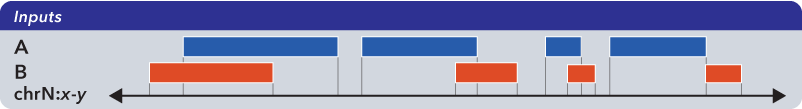
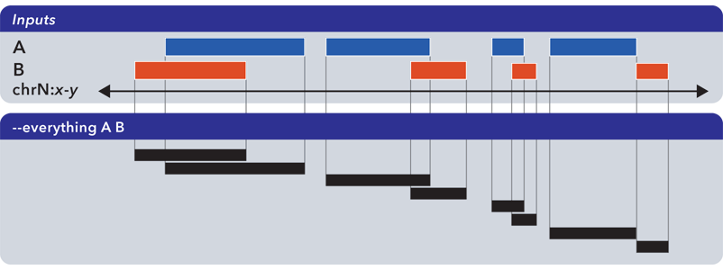
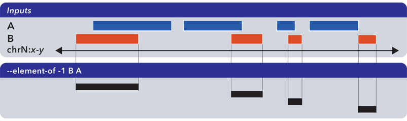
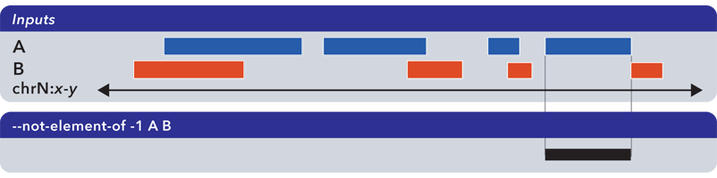
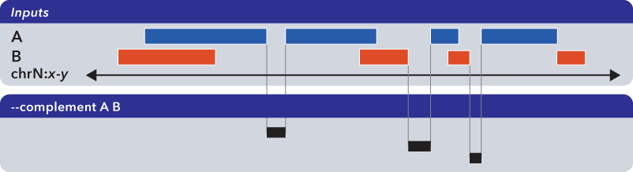
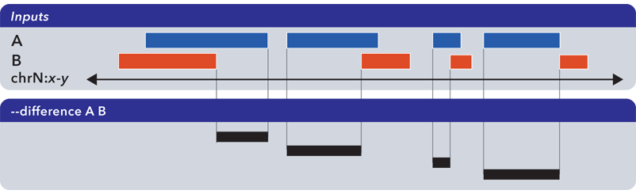
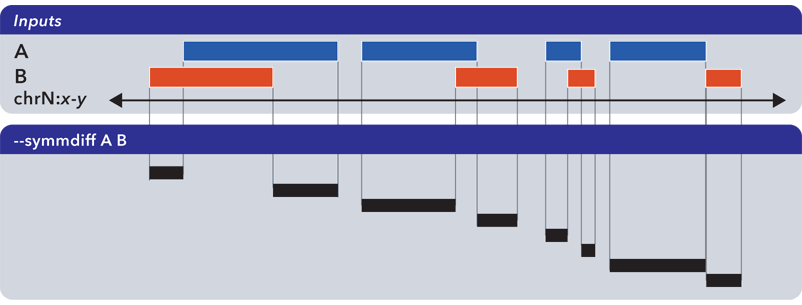

.. _bedops:

`bedops`
========

Finding relationships between two or more genomic datasets is an important problem. 

As examples, one might want to:

* Know how much overlap exists between the elements of two datasets, to quantitatively establish the degree to which they are similar
* Merge or filter elements. For example, retrieving non-overlapping, "unique" elements from multiple BED files.
* Split elements from multiple BED files into disjoint subsets.

The :ref:`bedops` program offers several Boolean set and multiset operations, including union, subset, and difference, to assist investigators with answering these types of questions. 

Importantly, :ref:`bedops` handles any number of any-size inputs at once when computing results in order to maximize efficiency. This use case has :ref:`serious practical consequences <multiple_inputs>` for many genomic studies.

One can also use :ref:`bedops` to symmetrically or asymmetrically pad coordinates.

==================
Inputs and outputs
==================

-----
Input
-----

The :ref:`bedops` program reads :ref:`sorted <sort-bed>` BED data and BEDOPS :ref:`Starch-formatted <starch>` archives as input.

Finally, :ref:`bedops` requires specification of a set operation (and, optionally, may include modifier options).

Support for common headers (including UCSC track headers) is offered through the ``--header`` option. Headers are stripped from output.

------
Output
------

The :ref:`bedops` program returns :ref:`sorted <sort-bed>` BED results to standard output. This output can be redirected to a file or piped to other utilities.

=====
Usage
=====

The :ref:`bedops` program takes sorted BED-formatted data as input, either from a file or streamed from standard input. It will process any number of input files in parallel.

If your data are unsorted, use BEDOPS :ref:`sort-bed` to prepare data for :ref:`bedops`. You only need to sort once, as all BEDOPS tools read and write sorted BED data.

Because memory usage is very low, one can use sorted inputs of any size. Processing times generally follow a simple linear relationship with input sizes (*e.g.*, as the input size doubles, the processing time doubles accordingly).

The ``--help`` option describes the set operation and other options available to the end user: 

::

  bedops
    citation: http://bioinformatics.oxfordjournals.org/content/28/14/1919.abstract
    version:  2.2.0
    authors:  Shane Neph & Scott Kuehn

      USAGE: bedops [process-flags] <operation> <File(s)>*

          Every input file must be sorted per the sort-bed utility.
          Each operation requires a minimum number of files as shown below.
            There is no fixed maximum number of files that may be used.
          Input files must have at least the first 3 columns of the BED specification.
          The program accepts BED and starch file formats.
          May use '-' for a file to indicate reading from standard input (BED format only).

      Process Flags:
          --chrom <chromosome> Process data for given <chromosome> only.
          --ec                 Error check input files (slower).
          --header             Accept headers (VCF, GFF, SAM, BED, WIG) in any input file.
          --help               Print this message and exit successfully.
          --help-<operation>   Detailed help on <operation>.
                                 An example is --help-c or --help-complement
          --range L:R          Add 'L' bp to all start coordinates and 'R' bp to end
                                 coordinates. Either value may be + or - to grow or
                                 shrink regions.  With the -e/-n operations, the first
                                 (reference) file is not padded, unlike all other files.
          --range S            Pad input file(s) coordinates symmetrically by S.
                                 This is shorthand for: --range -S:S.
          --version            Print program information.

      Operations: (choose one of)
          -c, --complement [-L] File1 [File]*
          -d, --difference ReferenceFile File2 [File]*
          -e, --element-of [-number% | -number (in bp)] ReferenceFile File2 [File]*
                 by default, -e -100% is used.
          -i, --intersect File1 File2 [File]*
          -m, --merge File1 [File]*
          -n, --not-element-of [-number% | -number (in bp)] ReferenceFile File2 [File]*
                 by default, -n -100% is used.
          -p, --partition File1 [File]*
          -s, --symmdiff File1 File2 [File]*
          -u, --everything File1 [File]*

      Example: bedops --range 10 -u file1.bed
      NOTE: Only operations -e|n|u preserve all columns (no flattening)

Extended help is available for all operations in :ref:`bedops`. For example, the ``--help-symmdiff`` option in :ref:`bedops` gives detailed information on the ``--symmdiff`` operation.

==========
Operations
==========

To demonstrate the various operations in :ref:`bedops`, we start with two simple datasets ``A`` and ``B``, containing genomic elements on generic chromsome ``chrN``:

These datasets can be :ref:`sorted <sort-bed>` BED or :ref:`Starch-formatted <starch>` files or streams.

-----------------------------
Everything (-u, --everything)
-----------------------------

The ``--everything`` option is equivalent to concatenating and sorting BED elements from multiple files, but works much faster:

As with all BEDOPS tools and operations, the output of this operation is :ref:`sorted <sort-bed>`.

.. important:: The ``--everything`` option preserves all columns from all inputs. This is useful for multiset unions of datasets with additional ID, score or other metadata.

-----------------------------
Element-of (-e, --element-of)
-----------------------------

The ``--element-of`` operation shows the elements of the first ("*reference*") file that overlap elements in the second and subsequent files by the specified length (in bases) or by percentage of length.

In the following example, we search for elements in the reference set ``A`` which overlap elements in ``B`` by at least one base:

Elements that are returned are always from the reference set (in this case, set ``A``).

.. important:: The ``--element-of`` option preserves all columns from the first (reference) input.

Note that `--element-of` is *not* a symmetric operation, as demonstrated by making ``B`` the reference set:

.. important:: The argument to ``--element-of`` is a value that species to degree of overlap for elements. The value is either integral for per-base overlap,  or fractional for overlap measured by length.

In sum, ``--element-of`` (``-e``) produces exactly everything that ``--not-element-of`` (``-n``) does not, given the same overlap criterion (which is 100% by default).

.. important:: For a more in-depth discussion of ``--element-of`` and how overlaps are determined with three or more input files, please review the `BEDOPS forum discussion <http://bedops.uwencode.org/forum/index.php?topic=20.0>`_ on this subject.

-------------------------------------
Not-element-of (-n, --not-element-of)
-------------------------------------

The ``--not-element-of`` operation shows elements in the reference file which do not overlap elements in all other sets. For example:

As with the ``--element-of`` (``-e``) operator, the overlap criterion for ``--not-element-of`` (``-n``) can be specified by length (in bases) or by percentage of length. Similarly, this operation is not symmetric |---| the order of inputs will specify the reference set.

.. important:: The ``--not-element-of`` operatior preserves columns from the first (reference) dataset.

.. important:: The same caveat applies to use of ``--not-element-of`` (``-n``) as with ``--element-of`` (``-e``), namely that the second and all subsequent input files are merged before the set operation is applied. Please review the BEDOPS `forum discussion thread <http://bedops.uwencode.org/forum/index.php?topic=20.0>`_ on this topic for more details.

-----------------------------
Complement (-c, --complement)
-----------------------------

The ``--complement`` operation calculates the genomic regions in the gaps between the contiguous per-chromosome ranges defined by one or more inputs. The following example shows the use of two inputs:

.. important:: Note this **computed result** will lack ID, score and other columnar data other than the first three columns that contain positional data. That is, computed elements will not come from any of the input sets, but are new elements created from the input set space.

.. important:: For a more in-depth discussion on using ``--complement`` with left and right bounds of input chromosomes, please review the BEDOPS `forum discussion <http://bedops.uwencode.org/forum/index.php?topic=19.0>`_ on this subject.

-----------------------------
Difference (-d, --difference)
-----------------------------

The ``--difference`` operation calculates the genomic regions found within the first (reference) input file, excluding regions in all other input files:

.. important:: As with ``--element-of`` and ``--not-element-of``, this operation is not symmetric. While ``--not-element-of`` preserves all columns of elements found in the reference input and allows one to define overlaps, the ``--difference`` operator simply reports every genomic range as three-column BED, which does not overlap elements found in the second and subsequent input files by any amount.

-------------------------------------
Symmetric difference (-s, --symmdiff)
-------------------------------------

The ``--symmdiff`` operation calculates the genomic range that is exclusive to each input, excluding any ranges shared across inputs:

.. tip:: It has been observed that ``--symmdiff`` (``-s``) is the same as ``--difference A B`` unionized with ``--difference B A``, but ``--symmdiff`` runs faster in practice.

---------------------------
Intersect (-i, --intersect)
---------------------------

-------------------
Merge (-m, --merge)
-------------------

---------------------------
Partition (-p, --partition)
---------------------------

-----------------------------------
Per-chromosome operations (--chrom)
-----------------------------------

---------------
Range (--range)
---------------

==============
Starch support
==============

=====================
Error checking (--ec)
=====================

====
Tips
====

-------------------
Chaining operations
-------------------

--------------
Sorting inputs
--------------

.. |--| unicode:: U+2013   .. en dash
.. |---| unicode:: U+2014  .. em dash, trimming surrounding whitespace
   :trim:
