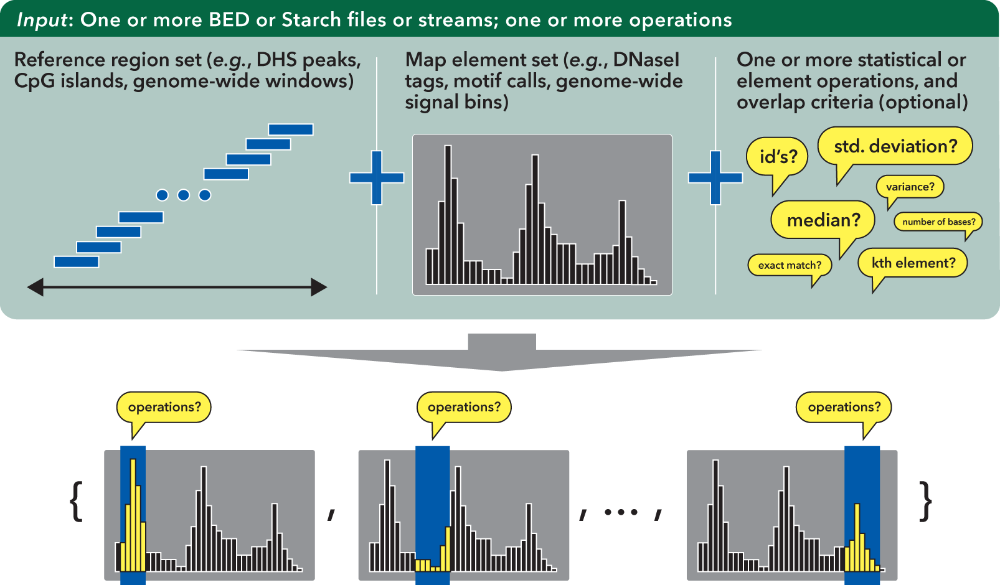
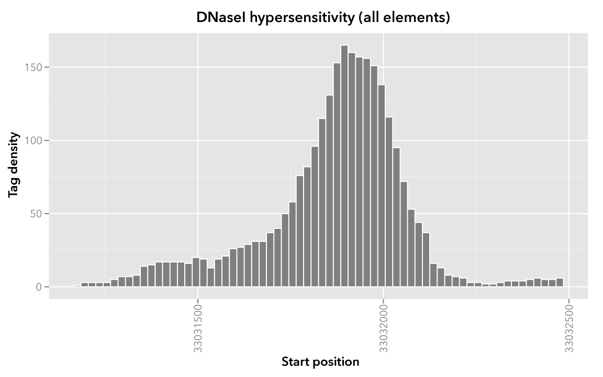
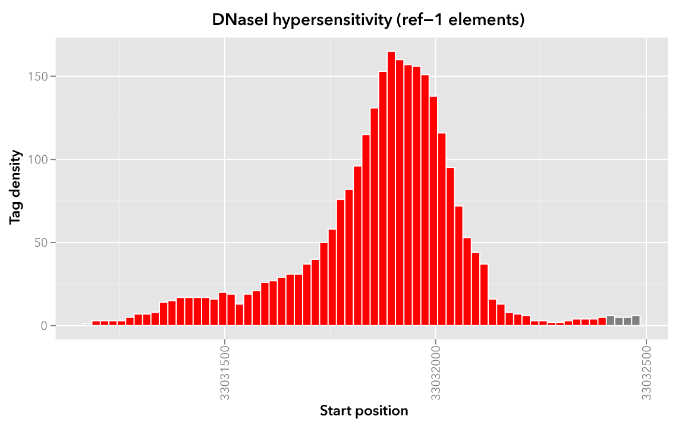
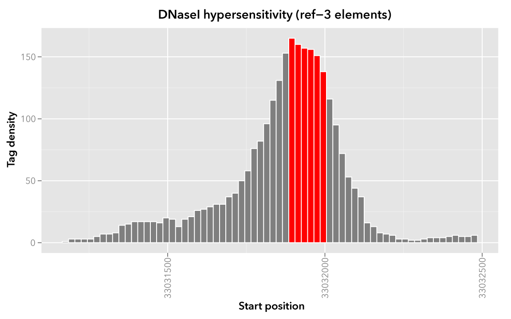

.. _bedmap:

`bedmap`
========

The ``bedmap`` program is used to retrieve and process signal or other features over regions of interest in BED files (including DNase hypersensitive regions, SNPs, transcription factor binding sites, etc.), performing tasks such as: :ref:`smoothing raw tag <smoothing_raw_tags>` count signal in preparation for uploading to the UCSC Genome Browser, :ref:`finding subsets of elements <finding_elements_within_elements>` within a larger coordinate set, :ref:`filtering multiple BED files <master_list>` by signal, :ref:`finding multi-input overlap <multiple_inputs>` solutions, and much, much more.

==================
Inputs and outputs
==================

-----
Input
-----

The :ref:`bedmap` program takes in *reference* and *mapping* files and calculates statistics for each reference element. These calculations |---| *operations* |---| are applied to overlapping elements from the mapped file:

The :ref:`bedmap` program requires files in a relaxed variation of the BED format as described by `UCSC's browser documentation <http://genome.ucsc.edu/FAQ/FAQformat.html#format1>`_. The chromosome field can be any non-empty string, the score field can be any valid numeric value, and information is unconstrained beyond the minimum number of columns required by the chosen options.

.. note:: Information is unconstrained, with one important exception: Map input (defined below) should not contain spaces in the ID or in subsequent fields. Running :ref:`bedmap` with :code:`--ec` will identify problematic input. 

   An :code:`awk` script can help with translating ID spaces to another non-whitespace delimiter, *e.g.*, :code:`bedmap (--options...) reference.bed <(awk -vOFS="\t" -vFS="\t" '{gsub(" ", "%%", $4); print;}' map.bed)` and then `awk -vOFS="\t" -vFS="\t" '{gsub("%%", " "); print;}' result.bed` to convert delimiters back to spaces.

Alternatively, :ref:`bedmap` can accept :ref:`Starch-formatted archives <starch>` of BED data as input |---| it is no longer necessary to extract Starch archive data to intermediate BED files!

Support for common headers (including UCSC browser track headers) is available with the ``--header`` option, although headers are stripped from output.

Most importantly, :ref:`bedmap` expects :ref:`sorted <sort-bed>` inputs. You can use the BEDOPS :ref:`sort-bed` program to ensure your inputs are properly sorted. 

.. note:: You only need to sort once, and only if your input data are unsorted, as all BEDOPS tools take in and export sorted BED data.

Operations are applied over map elements that overlap the coordinates of each reference element. You can use the default overlap criterion of one base, or define your own criteria using the :ref:`overlap criteria operators <bedmap_overlap_criteria>`.

Once you have overlapping elements, you can either perform :ref:`numerical calculations <bedmap_score_operations>` on their scores or return identifiers or other :ref:`non-score information <bedmap_non_score_operations>`. Additional :ref:`modifier operators <bedmap_modifier_operations>` allow customization of how output is presented, to assist with downstream processing in a pipeline setting.

------
Output
------

Depending on specified options, the :ref:`bedmap` program can send a variety of delimited information about the reference and mapped elements (as well as analytical results) to standard output. If the ``--echo`` option is used, the output will be at least a three-column BED file. The use of predictable delimiters (which are customizable) and the use of UNIX-like standard streams allows easy downstream analysis or post-processing with other tools and scripts.

=====
Usage
=====

The ``--help`` option describes the various mapping and analytical operations and other options available to the end user:

::

  bedmap
    citation: http://bioinformatics.oxfordjournals.org/content/28/14/1919.abstract
    version:  2.4.39 (typical)
    authors:  Shane Neph & Scott Kuehn

   USAGE: bedmap [process-flags] [overlap-option] <operation(s)...> <ref-file> [map-file]
       Any input file must be sorted per the sort-bed utility.
       The program accepts BED and Starch file formats.
       You may use '-' for a BED file to indicate the input comes from stdin.

       Traverse <ref-file>, while applying <operation(s)> on qualified, overlapping elements from
         <map-file>.  Output is one line for each line in <ref-file>, sent to standard output.  There
         is no limit on the number of operations you can specify to compute in one bedmap call.
       If <map-file> is omitted, the given file is treated as both the <ref-file> and <map-file>.
         This usage is more efficient than specifying the same file twice.
       Arguments may be given in any order before the input file(s).

      Process Flags:
       --------
        --chrom <chromosome>  Jump to and process data for given <chromosome> only.
        --delim <delim>       Change output delimiter from '|' to <delim> between columns (e.g. '\t').
        --ec                  Error check all input files (slower).
        --faster              (advanced) Strong input assumptions are made.  Compatible with:
                                --bp-ovr, --range, --fraction-both, and --exact overlap options only.
        --header              Accept headers (VCF, GFF, SAM, BED, WIG) in any input file.
        --help                Print this message and exit successfully.
        --min-memory          Minimize memory usage (slower).
        --multidelim <delim>  Change delimiter of multi-value output columns from ';' to <delim>.
        --prec <int>          Change the post-decimal precision of scores to <int>.  0 <= <int>.
        --sci                 Use scientific notation for score outputs.
        --skip-unmapped       Print no output for a row with no mapped elements.
        --sweep-all           Ensure <map-file> is read completely (helps to prevent broken pipes).
        --unmapped-val <val>  Print <val> on unmapped --echo-map* and --min/max-element* operations.
                                The default is to print nothing.
        --unmapped-val <val>  Use <val> in place of the empty string on unmapped --echo-map* ops.
        --version             Print program information.

      Overlap Options (At most, one may be selected.  By default, --bp-ovr 1 is used):
       --------
        --bp-ovr <int>           Require <int> bp overlap between elements of input files.
        --exact                  First 3 fields from <map-file> must be identical to <ref-file>'s.
        --fraction-ref <val>     The fraction of the element's size from <ref-file> that must overlap
                                   the element in <map-file>.  Expect 0 < val <= 1.
        --fraction-map <val>     The fraction of the element's size from <map-file> that must overlap
                                   the element in <ref-file>.  Expect 0 < val <= 1.
        --fraction-both <val>    Both --fraction-ref <val> and --fraction-map <val> must be true to
                                   qualify as overlapping.  Expect 0 < val <= 1.
        --fraction-either <val>  Either --fraction-ref <val> or --fraction-map <val> must be true to
                                   qualify as overlapping.  Expect 0 < val <= 1.
        --range <int>            Grab <map-file> elements within <int> bp of <ref-file>'s element,
                                   where 0 <= int.  --range 0 is an alias for --bp-ovr 1.

      Operations:  (Any number of operations may be used any number of times.)
       ----------
        SCORE:
         <ref-file> must have at least 3 columns and <map-file> 5 columns.

        --cv                The result of --stdev divided by the result of --mean.
        --kth <val>         Generalized median. Report the value, x, such that the fraction <val>
                              of overlapping elements' scores from <map-file> is less than x,
                              and the fraction 1-<val> of scores is greater than x.  0 < val <= 1.
        --mad <mult=1>      The median absolute deviation of overlapping elements in <map-file>.
                              Multiply mad score by <mult>.  0 < mult, and mult is 1 by default.
        --max               The highest score from overlapping elements in <map-file>.
        --max-element       A (non-random) highest-scoring and overlapping element in <map-file>.
        --max-element-rand  A random highest-scoring and overlapping element in <map-file>.
        --mean              The average score from overlapping elements in <map-file>.
        --median            The median score from overlapping elements in <map-file>.
        --min               The lowest score from overlapping elements in <map-file>.
        --min-element       A (non-random) lowest-scoring and overlapping element in <map-file>.
        --min-element-rand  A random lowest-scoring and overlapping element in <map-file>.
        --stdev             The square root of the result of --variance.
        --sum               Accumulated scores from overlapping elements in <map-file>.
        --tmean <low> <hi>  The mean score from overlapping elements in <map-file>, after
                              ignoring the bottom <low> and top <hi> fractions of those scores.
                              0 <= low <= 1.  0 <= hi <= 1.  low+hi <= 1.
        --variance          The variance of scores from overlapping elements in <map-file>.
        --wmean             Weighted mean, scaled in proportion to the coverage of the <ref-file>
                              element by each overlapping <map-file> element.

       ----------
        NON-SCORE:
         <ref-file> must have at least 3 columns.
         For --echo-map-id/echo-map-id-uniq, <map-file> must have at least 4 columns.
         For --echo-map-score, <map-file> must have at least 5 columns.
         For all others, <map-file> requires at least 3 columns.

        --bases             The total number of overlapping bases from <map-file>.
        --bases-uniq        The number of distinct bases from <ref-file>'s element covered by
                              overlapping elements in <map-file>.
        --bases-uniq-f      The fraction of distinct bases from <ref-file>'s element covered by
                              overlapping elements in <map-file>.
        --count             The number of overlapping elements in <map-file>.
        --echo              Print each line from <ref-file>.
        --echo-map          List all overlapping elements from <map-file>.
        --echo-map-id       List IDs from all overlapping <map-file> elements.
        --echo-map-id-uniq  List unique IDs from overlapping <map-file> elements.
        --echo-map-range    Print genomic range of overlapping elements from <map-file>.
        --echo-map-score    List scores from overlapping <map-file> elements.
        --echo-map-size     List the full length of every overlapping element.
        --echo-overlap-size List lengths of overlaps.
        --echo-ref-name     Print the first 3 fields of <ref-file> using chrom:start-end format.
        --echo-ref-row-id   Print 'id-' followed by the line number of <ref-file>.
        --echo-ref-size     Print the length of each line from <ref-file>.
        --indicator         Print 1 if there exists an overlapping element in <map-file>, 0 otherwise.

.. _bedmap_operations:

==========
Operations
==========

To demonstrate the various operations in :ref:`bedmap`, we start with two simple, pre-sorted BED files that we label as ``Map`` and ``Reference`` (see the :ref:`Downloads <bedmap_downloads>` section for files you can use to follow along).

Our ``Map`` file is a snippet of real-world BED data derived from `ENCODE <http://www.uwencode.org/>`_ experiments conducted by our lab: specifically, raw `DNaseI hypersensitivity <http://en.wikipedia.org/wiki/Hypersensitive_site>`_ signal for the human K562 cell line (region ``chr21:33031165-33032485``, assembly ``GRCh37/h19`` and table ``wgEncodeUwDnaseK562RawRep1`` from the `UCSC Genome Browser <http://genome.ucsc.edu/>`_).

This raw signal is the density of sequence tags which map within a 150 bp sliding window, at 20 bp steps across the genome |---| a smoothed picture of DNaseI hypersensitivity:

::

  chr21   33031165        33031185        map-1   1.000000
  chr21   33031185        33031205        map-2   3.000000
  chr21   33031205        33031225        map-3   3.000000
  chr21   33031225        33031245        map-4   3.000000   
  chr21   33031245        33031265        map-5   3.000000
  chr21   33031265        33031285        map-6   5.000000
  chr21   33031285        33031305        map-7   7.000000
  chr21   33031305        33031325        map-8   7.000000
  chr21   33031325        33031345        map-9   8.000000
  chr21   33031345        33031365        map-10  14.000000
  chr21   33031365        33031385        map-11  15.000000
  chr21   33031385        33031405        map-12  17.000000
  chr21   33031405        33031425        map-13  17.000000
  ...
  chr21   33032425        33032445        map-64  5.000000
  chr21   33032445        33032465        map-65  5.000000
  chr21   33032465        33032485        map-66  6.000000

When visualized, the signal data has the following appearance:

.. note:: Rectangles colored in grey represent each of the sixty-six ``map`` elements. The x-axis represents the start coordinate of the ``map`` element, while the y-axis denotes the tag density, or sum of tags over that element's 20-base window.

Our sample ``Reference`` file is not as exciting. It is just three BED elements which span portions of this density file:

::

  chr21   33031200    33032400    ref-1
  chr21   33031400    33031800    ref-2
  chr21   33031900    33032000    ref-3

These reference elements could be exons, promoter regions, etc. It doesn't matter for purposes of demonstration here, except to say that we can use :ref:`bedmap` to ask some questions about the ``Reference`` set. 

Among them, what are the quantitative and qualitative features of the ``map`` elements that span over these three reference regions? For example, we might want to know the mean DNase hypersensitivity across each |---| the answer may have some biological significance.

It may help to first visualize the reference regions and the mapped elements associated with them. A default :ref:`bedmap` task will operate on the following set of mapped (red-colored) elements, for each reference element ``ref-1``, ``-2`` and ``-3``.

Here we show elements from the ``Map`` set which overlap the ``ref-1`` region ``chr21:33031200-33032400``, colored in red:

Likewise, here are elements of the ``Map`` set which overlap the ``ref-2`` element ``chr21:33031400-33031800`` and ``ref-3`` element ``chr21:33031900-33032000``, respectively, with the same coloring applied:

.. image:: ../../../assets/reference/statistics/reference_bedmap_mapref_ref2.png
   :width: 99%

In these sample files, we provide the ``Map`` file with ID and score columns, and the ``Reference`` file with an ID column. These extra columns are not required by :ref:`bedmap`, but we can use the information in these columns in conjunction with the options provided by :ref:`bedmap` to identify matches, retrieve matched signals, and summarize data about signal across mapped elements.

.. _bedmap_overlap_criteria:

----------------
Overlap criteria
----------------

The default overlap criterion that :ref:`bedmap` uses is *one base*. That is, one or more bases of overlap between reference and mapping elements is sufficient for inclusion in operations. This value can be adjusted with the ``--bp-ovr`` option. The ``--range`` overlap option implicitly applies ``--bp-ovr 1`` after symmetrically padding elements.

If a fractional overlap is desired, the ``--fraction-{ref,map,both,either}`` options provide the ability to filter on overlap by a specified percentage of the length of either or both the reference and mapping elements.

Finally, the ``--exact`` flag enforces exact matches between reference and mapping elements. 

.. note:: The ``--exact`` option is an alias for ``--fraction-both 1``.

^^^^^^^^^^^^^^^^^^^^^^^^^^^^^^^^^^^^^^^^^^^^^^^^^^^^^^^^^^^^^^^^^^^^^^^^^^^^^^^^^^^^^
Using ``--faster`` with ``--bp-ovr``, ``--fraction-both``, ``--exact`` or ``--range``
^^^^^^^^^^^^^^^^^^^^^^^^^^^^^^^^^^^^^^^^^^^^^^^^^^^^^^^^^^^^^^^^^^^^^^^^^^^^^^^^^^^^^

The ``--faster`` modifier works with the ``--bp-ovr``, ``--fraction-both`` and ``--exact`` (``--fraction-both 1``) overlap and ``--range`` specifiers to dramatically increase the performance of :ref:`bedmap`, when the following input restriction is met:

* No :ref:`fully-nested elements <nested_elements>` in any input mapping file (duplicate elements and other overlapping elements are okay).

.. note:: The details of this restriction are explained in more detail in the :ref:`nested element documentation <nested_elements>`.

This option also works with the ``--ec`` error checking flag, which indicates if the data contain nested elements. Using ``--ec`` carries its usual overhead, but as it only doubles the much-improved execution time, it may be worth using.

.. tip:: To give an idea of the speed improvement, a ``--range 100000 --echo --count`` operation on 8.4 million, non-nested mapping elements (DNaseI footprints across multiple cell types) took *2 minutes and 55 seconds* without speed-up. By adding the ``--faster`` flag, the same calculation took *10 seconds*. That is an **18-fold** speed improvement.
 
   One scenario where this option can provide great speed gains is where ``--range`` is used with a large numerical parameter. Another scenario where this option is very useful is where the reference file has large elements, and the mapping file is made up of many small elements |---| specifically, where a number of small elements overlap each big element from the reference file. 

   An example of a research application for our lab which benefits from this flag is where we perform statistical analysis of large numbers of small sequence tags that fall in hotspot regions.

   If your data meet the :ref:`non-nesting criteria <nested_elements>`, using ``--faster`` with ``--bp-ovr``, ``--fraction-both``, ``--exact`` or ``--range`` is *highly recommended*.

.. note:: Our lab works with BED data of various types: cut-counts, hotspots, peaks, footprints, etc. These data generally do not contain nested elements and so are amenable to use with :ref:`bedmap's <bedmap>` ``--faster`` flag for extracting overlapping elements.

   However, other types of data can be problematic. `FIMO <http://meme.nbcr.net/meme/fimo-intro.html>`_ search results, for example, may cause trouble, where the boundaries of one motif hit can be contained within another larger hit. Or paired-end sequence data, where tags are not of a fixed length.

   Be sure to consider the makeup of your BED data before using ``--faster``. 

.. tip:: Using ``--ec`` with ``--faster`` will report if any nested elements exist in your data.

.. _bedmap_score_operations:

----------------
Score operations
----------------

Score operators apply a numerical calculation on the values of the score column of mapping elements. Per `UCSC specifications <http://genome.ucsc.edu/FAQ/FAQformat.html#format1>`_, :ref:`bedmap` assumes the score data are stored in the fifth column.

The variety of score operators include common statistical measures:

* `mean <http://en.wikipedia.org/wiki/Expected_value>`_ (``--mean``)
* `trimmed mean <http://en.wikipedia.org/wiki/Truncated_mean>`_ (``--tmean``)
* `weighted mean <http://en.wikipedia.org/wiki/Weighted_arithmetic_mean>`_ (``--wmean``)
* `standard deviation <http://en.wikipedia.org/wiki/Standard_deviation>`_ (``--stdev``)
* `variance <http://en.wikipedia.org/wiki/Variance>`_ (``--variance``)
* `coefficient of variance <http://en.wikipedia.org/wiki/Coefficient_of_variation>`_ (``--cv``)
* `median <http://en.wikipedia.org/wiki/Median>`_ (``--median``)
* `median absolute deviation <http://en.wikipedia.org/wiki/Median_absolute_deviation>`_ (``--mad``)
* `k-th order statistic <http://en.wikipedia.org/wiki/Order_statistic>`_ (``--kth``)

One can also take the sum of scores (``--sum``), find the minimum or maximum score over a region (``--min`` and ``--max``, respectively), or retrieve the map element with the least or greatest signal over the reference region (``--min-element`` and ``--max-element``, respectively).

.. note:: Map input should not contain spaces in the ID or in subsequent fields. Running :ref:`bedmap` with :code:`--ec` will identify problematic input. Spaces in these fields will cause problems with :code:`--min-element`, :code:`--max-element`, and other options that require parsing of the fourth and subsequent columns of the map input.

   An :code:`awk` script can help with translating ID spaces to another non-whitespace delimiter, *e.g.*, :code:`bedmap (--options...) reference.bed <(awk -vOFS="\t" -vFS="\t" '{gsub(" ", "%%", $4); print;}' map.bed)` and then `awk -vOFS="\t" -vFS="\t" '{gsub("%%", " "); print;}' result.bed` to convert delimiters back to spaces.

We will demonstrate some of these operators by applying them to the ``Reference`` and ``Map`` datasets (see the :ref:`Downloads <bedmap_downloads>` section for sample inputs).

As a reminder, the ``Map`` file contains regions of DNaseI-seq tag density. If we want the mean of the density across `Reference` elements, we use the ``--mean`` option:

::

  $ bedmap --echo --mean reference.bed map.bed > mappedReferences.mean.bed

The ``--echo`` flag prints each ``Reference`` element, while the ``--mean`` flag calculates the mean signal of the ``Map`` elements which overlap the reference element:

::

  $ more mappedReferences.mean.bed
  chr21   33031200    33032400    ref-1|43.442623
  chr21   33031400    33031800    ref-2|31.571429
  chr21   33031900    33032000    ref-3|154.500000

This result tells us that the mean density across regions ``ref-1``, ``ref-2`` and ``ref-3`` is ``44.442623``, ``31.571429`` and ``154.5``, respectively.

.. note:: The pipe character (``|``) delimits the results of each specified option (with the exception of the so-called "multi" operators that return multiple results — this is discussed in the section on ``--echo`` flags). In the provided example, the delimiter divides the reference element from the mean score across the reference element.

.. tip:: Because we used the ``--echo`` flag in this example, we are guaranteed output that is at least three-column BED format and which is :ref:`sorted <sort-bed>`, which can be useful for `pipeline <http://en.wikipedia.org/wiki/Pipeline_(Unix)>`_ design, where results are piped downstream to :ref:`bedmap`, :ref:`bedops` and other BEDOPS and UNIX utilities.

If we simply want the mean values and don't care about the reference data, we can skip ``--echo``:

::

  $ bedmap --mean reference.bed map.bed
  43.442623
  31.571429
  154.500000

While not very detailed, this single-column representation can be useful for those who use UNIX utilities like ``paste`` or need to do additional downstream calculations with ``R`` or other utilities, where the reference information is unnecessary (or, at least, more work to excise).

If a reference element does not overlap any map element, then a ``NAN`` is returned for any operation on that entry, *e.g.*, we know that the *ad hoc* element ``chr21:1000-2000`` does not overlap any member of our ``Map`` dataset, and there is therefore no mean value that can be calculated for that element:

::

  $ echo -e "chr21\t1000\t2000\tfoo-1" | bedmap --echo --mean - map.bed
  chr21   1000    2000    foo-1|NAN

.. tip:: For this example, we use ``echo -e`` to send :ref:`bedmap` a sample reference coordinate by way of standard input. The :ref:`bedmap` program can process any BED data from the standard input stream, either as the reference or map data, by placing the dash character (``-``) where the file name would otherwise go. 

   In the example above, we sent :ref:`bedmap` a single reference element via standard input, but multiple lines of BED data can come from other upstream processes. 

   Using `standard streams <http://en.wikipedia.org/wiki/Pipeline_(Unix)>`_ is useful for reducing file I/O and improving performance, especially in situations where one is using :ref:`bedmap` in the middle of an extended pipeline.

While :ref:`bedmap` returns a ``NAN`` if there are no mapped elements that associate with a reference element, we may want to filter these lines out. We can apply the ``--skip-unmapped`` option to leave out reference elements without mapped elements:

::

  $ echo -e "chr21\t1000\t2000\tfoo-1" | bedmap --echo --mean --skip-unmapped - map.bed 
  $

.. note:: Some operations may yield a reference element with one or more mapped elements, which still return a ``NAN`` value by virtue of the calculation result. The ``--skip-unmapped`` operand will still allow these reference elements to be printed out!

   For instance, consider the ``--variance`` operator, which requires two or more map elements to calculate a variance. Where there is only one mapped element associated with the reference element, a ``--variance`` calculation will return a ``NAN``. In this case, ``--skip-unmapped`` will still print this element, even though the result is ``NAN``. 

   Given the following statement:

   ::

     $ bedmap --skip-unmapped --variance file1 file2

   This is functionally equivalent to the following statement:

   ::

     $ bedmap --indicator --variance --delim "\t" file1 file2 | awk '($1==1) {print $2}'

   The ``--indicator`` operand calculates whether there are any mapped elements (or none) |---| see the :ref:`indicator <bedmap_indicator>` section for more detail. The ``awk`` statement then prints results which have one or more mapped elements, effectively filtering unmapped references.

   It should therefore be more convenient to use ``--skip-unmapped`` where unmapped reference elements are not needed.

Another option is to retrieve the mapping element with the highest or lowest score within the reference region, using the ``--max-element`` or ``--min-element`` operators, respectively.

Going back to our sample ``Reference`` and ``Map`` data, we can search for the highest scoring mapping elements across the three reference elements:

::

  $ bedmap --echo --max-element --prec 0 reference.bed map.bed
  chr21   33031200        33032400        ref-1|chr21     33031885        33031905        map-37  165
  chr21   33031400        33031800        ref-2|chr21     33031785        33031805        map-32  82
  chr21   33031900        33032000        ref-3|chr21     33031885        33031905        map-37  165

Over reference elements ``ref-1`` and ``ref-3``, the mapping element ``map-37`` has the highest score. Over reference element ``ref-2``, the highest scoring mapping element is ``map-32``.

Likewise, we can repeat this operation, but look for the lowest scoring elements, instead:

::

  $ bedmap --echo --min-element --prec 0 reference.bed map.bed
  chr21   33031200        33032400        ref-1|chr21     33032265        33032285        map-56  2
  chr21   33031400        33031800        ref-2|chr21     33031525        33031545        map-19  13
  chr21   33031900        33032000        ref-3|chr21     33031985        33032005        map-42  138

.. note:: Where there are ties in score values, using ``--max-element`` or ``--min-element`` now selects the lexicographically smallest element amongst the set of tied elements. This generally means that the first element in the lexicographic ordering of the ID fields (fourth column) will determine the selection. 

   A random selection process was used for ``--max-element`` and ``--min-element`` in versions 2.4.20 and previous. If you wish to randomly sample a maximum- or minimum-scoring element from amongst tied elements (say, to reproduce the procedure of prior analyses), you may use the ``--max-element-rand`` or ``--min-element-rand`` options, respectively.

We can also perform multiple score operations, which are summarized on one line, *e.g.*, to show the mean, standard deviation, and minimum and maximum signal over each ``Reference`` element, we simply add the requisite options in series:

::

  $ bedmap --echo --mean --stdev --min --max reference.bed map.bed
  chr21   33031200    33032400    ref-1|43.442623|50.874527|2.000000|165.000000
  chr21   33031400    33031800    ref-2|31.571429|19.638155|13.000000|82.000000
  chr21   33031900    33032000    ref-3|154.500000|9.311283|138.000000|165.000000

Multiple score-operational results are ordered identically with the command-line options. The section on :ref:`formatting score output <bedmap_formatting_score_output>` demonstrates how one can change the precision and general format of numerical score results.

.. _bedmap_non_score_operations:

--------------------
Non-score operations
--------------------

Sometimes it is useful to get summary or non-score statistics about the map elements. This category of operators returns information from the ID column of mapping elements, or can return counts and base overlap totals. 

.. note:: As with score data, we follow the `UCSC convention <http://genome.ucsc.edu/FAQ/FAQformat.html#format1>`_ for the BED format and retrieve ID data from the fourth column.

.. _bedmap_echo:

^^^^
Echo
^^^^

The ID, score and coordinate columns of the reference and map files are very useful for reading and debugging results, or reporting a more detailed mapping.

We can use the ``--echo``, ``--echo-map``, ``--echo-map-id``, ``--echo-map-id-uniq``, ``--echo-map-score``, ``--echo-map-range``, ``--echo-map-size``, ``--echo-overlap-size``, ``--echo-ref-name``, ``--echo-ref-row-id``, and ``echo-ref-size`` flags to tell :ref:`bedmap` to report additional details about the reference and map elements.

The ``--echo`` flag reports each reference element. We have already seen the application of ``--echo`` in earlier examples. The option helps to clearly associate results from other chosen operations with specific reference elements. Additionally, ``--echo`` enables the output from :ref:`bedmap` to be used as input to additional BEDOPS utilities, including :ref:`bedmap` itself.

The ``--echo-map`` flag gathers overlapping mapped elements for every reference element. The option is useful for debugging and detailed downstream processing needs. This is the most general operation in :ref:`bedmap` in that overlapping elements are returned in full detail, for every reference element. While results are well-defined and easily parsed, the output can be very large and difficult to read.

As an example of using the ``--echo-map-id`` operator in a biological context, we examine a `FIMO <http://meme.nbcr.net/meme/fimo-intro.html>`_ analysis that returns a subset of transcription factor binding sites in BED format, with `TRANSFAC <http://en.wikipedia.org/wiki/TRANSFAC>`_ motif names listed in the ID column:

::

  chr1    4534161 4534177 -V_GRE_C        4.20586e-06     -       CGTACACACAGTTCTT
  chr1    4534192.4.394205 -V_STAT_Q6      2.21622e-06     -       AGCACTTCTGGGA
  chr1    4534209 4534223 +V_HNF4_Q6_01   6.93604e-06     +       GGACCAGAGTCCAC
  chr1    4962522.4.392540 -V_GCNF_01      9.4497e-06      -       CCCAAGGTCAAGATAAAG
  chr1    4962529 4962539 +V_NUR77_Q5     8.43564e-06     +       TTGACCTTGG
  ...

This input is available from the :ref:`Downloads <bedmap_downloads>` section as the ``Motifs`` dataset.

We will treat this as a map file, asking which motif IDs are associated with a region of interest (``chr1:4534150-4534300``). To do this using :ref:`bedmap`, we use the ``--echo-map-id`` option to summarize the IDs of mapped elements:

::

  $ echo -e "chr1\t4534150\t4534300\tref-1" | bedmap --echo --echo-map-id - motifs.bed
  chr1    4534150 4534300 ref-1|-V_GRE_C;-V_STAT_Q6;+V_HNF4_Q6_01

.. note:: To expand on the types of questions one can answer with :ref:`bedmap` in this context, in conjunction with the ``--count`` operator (described below), one can quantify predicted transcription factor binding sites by sliding a reference window across the entire genome. 

   One could determine, for example, where predicted sites are most prevalent and investigate the distribution of factors or other genomic features at or around these dense regions.

The ``--echo-map-id-uniq`` operator works exactly like ``--echo-map-id``, except that duplicate IDs are removed from the result. For example, we can pull all the motifs hits from a wide region on ``chr2``:

::

  $ echo -e "chr2\t1000\t10000000\tref-1" | bedmap --echo --echo-map-id - motifs.bed
  chr2    1000    10000000        ref-1|+V_OCT1_05;+V_OCT_C;-V_CACD_01;+V_IRF_Q6;-V_BLIMP1_Q6;-V_IRF2_01;-V_IRF_Q6_01;+V_SMAD_Q6_01;-V_TATA_01;-V_TATA_C;-V_CEBP_01;-V_HNF6_Q6;+V_MTF1_Q4;+V_MYOD_Q6_01;-V_KROX_Q6;+V_EGR1_01;-V_SP1SP3_Q4;+V_EGR_Q6;+V_SP1_Q6;-V_SP1_Q2_01;-V_CKROX_Q2;+V_SP1_Q6_01;-V_SREBP1_Q5;+V_VDR_Q3;-V_DMRT1_01;-V_DMRT7_01;+V_DMRT1_01;-V_DMRT1_01;-V_DMRT7_01;+V_DMRT1_01;-V_DMRT1_01;-V_DMRT7_01

However, some hits (*e.g.*, ``-V_DMRT7_01``) show up two or more times. If we want a non-redundant list, we replace ``--echo-map-id`` with ``--echo-map-id-uniq``:

::

  $ echo -e "chr2\t1000\t10000000\tref-1" | bedmap --echo --echo-map-id-uniq - motifs.bed
  chr2    1000    10000000        ref-1|+V_DMRT1_01;+V_EGR1_01;+V_EGR_Q6;+V_IRF_Q6;+V_MTF1_Q4;+V_MYOD_Q6_01;+V_OCT1_05;+V_OCT_C;+V_SMAD_Q6_01;+V_SP1_Q6;+V_SP1_Q6_01;+V_VDR_Q3;-V_BLIMP1_Q6;-V_CACD_01;-V_CEBP_01;-V_CKROX_Q2;-V_DMRT1_01;-V_DMRT7_01;-V_HNF6_Q6;-V_IRF2_01;-V_IRF_Q6_01;-V_KROX_Q6;-V_SP1SP3_Q4;-V_SP1_Q2_01;-V_SREBP1_Q5;-V_TATA_01;-V_TATA_C

The ``--echo-map-score`` flag works in a similar fashion to ``--echo-map-id``, reporting scores instead of IDs. The :ref:`formatting score output <bedmap_formatting_score_output>` section demonstrates how one can use ``--echo-map-score`` to summarize score data from mapped elements.

.. note:: Both the ``--echo-map-id`` and ``--echo-map-score`` flags use the semi-colon (``;``) as a default delimiter, which may be changed with the ``--multidelim`` option (see the :ref:`Delimiters <bedmap_delimiters>` section for more information on this and other modifier operators).

The ``--echo-map-range`` flag tells :ref:`bedmap` to report the genomic range of overlapping mapped elements. If we apply this flag to the ``Reference`` and ``Map`` datasets (see :ref:`Downloads <bedmap_downloads>`), we get the following result:

::

  $ bedmap --echo --echo-map-range reference.bed map.bed
  chr21   33031200    33032400    ref-1|chr21 33031185    33032405
  chr21   33031400    33031800    ref-2|chr21 33031385    33031805
  chr21   33031900    33032000    ref-3|chr21 33031885    33032005

.. note:: The ``--echo-map-range`` option produces three-column BED results that are not always guaranteed to be sorted. The ``--echo`` operation is independent, and it produces reference elements in proper BEDOPS order, as shown. If the results of the ``--echo-map-range`` option will be used directly as BED coordinates in downstream BEDOPS analyses (*i.e.*, no ``--echo`` operator), first pipe them to :ref:`sort-bed` to ensure proper sort order.

.. note:: Map input should not contain spaces in the ID or in subsequent fields. Running :ref:`bedmap` with :code:`--ec` will identify problematic input. Spaces in these fields will cause problems with :code:`--echo-map-id`, :code:`--echo-map-id-uniq`, and other options that require parsing of the fourth and subsequent columns of the map input.

   An :code:`awk` script can help with translating ID spaces to another non-whitespace delimiter, *e.g.*, :code:`bedmap (--options...) reference.bed <(awk -vOFS="\t" -vFS="\t" '{gsub(" ", "%%", $4); print;}' map.bed)` and then `awk -vOFS="\t" -vFS="\t" '{gsub("%%", " "); print;}' result.bed` to convert delimiters back to spaces.

The ``--echo-ref-size`` flag reports the difference between the stop and start coordinates of the reference element.  The ``--echo-ref-name`` flag produces a converted format for the first 3 BED fields, A:B-C, where A is the chromosome name, B is the start coordinate, and C is the stop coordinate for that reference element.

The ``--echo-ref-row-id`` flag prints the prefix ``id-`` with the line number of the reference element.

Finally, the ``--echo-map-size`` flag reports the difference between the stop and start coordinates of each mapped element, while the ``--echo-overlap-size`` flag reports the length of the overlap between the reference element and each mapped element. 

.. _bedmap_element_and_overlap_statistics:

^^^^^^^^^^^^^^^^^^^^^^^^^^^^^^
Element and overlap statistics
^^^^^^^^^^^^^^^^^^^^^^^^^^^^^^

Looking back at the ``Map`` and ``Reference`` datasets, let's say we want to count the number of elements in ``Map`` that overlap a given ``Reference`` element, as well as the extent of that overlap as measured by the total number of overlapping bases from mapped elements. For this, we use the ``--count`` and ``--bases`` flags, respectively:

::

  $ bedmap --echo --count --bases reference.bed map.bed
  chr21   33031200    33032400    ref-1|61|1200
  chr21   33031400    33031800    ref-2|21|400
  chr21   33031900    33032000    ref-3|6|100

This result tells us that there are 61 elements in ``Map`` that overlap ``ref-1``, and 1200 total bases from the 61 elements overlap bases of ``ref-1``. Similarly, 21 elements overlap ``ref-2``, and 400 total bases from the 21 elements overlap bases of ``ref-2``, etc.

The ``--bases`` operator works on ``Map`` elements. If, instead, we want to quantify the degree to which ``Reference`` elements overlap ``Map`` , we can use the ``--bases-uniq`` and ``--bases-uniq-f`` flags to count the number of bases and, respectively, the fraction of total bases within ``Reference`` which are covered by overlapping elements in ``Map``.

This last example uses ``Motifs`` elements and all of the options: ``--bases``, ``--bases-uniq`` and ``--bases-uniq-f``, to illustrate their different behaviors:

::

  $ echo -e "chr1\t4534161\t4962550\tadhoc-1" | bedmap --echo --bases --bases-uniq --bases-uniq-f - motifs.bed
  chr1    4534161     4962550     adhoc-1|169|71|0.000166

.. _bedmap_indicator:

^^^^^^^^^
Indicator
^^^^^^^^^

If we simply want to know if a reference element overlaps one or more map elements, we can use the ``--indicator`` operator, which returns a ``1`` or ``0`` value, depending on whether there is or is not an overlap, respectively. For example:

::

  $ bedmap --echo --indicator reference.bed map.bed
  chr21   33031200    33032400    ref-1|1
  chr21   33031400    33031800    ref-2|1
  chr21   33031900    33032000    ref-3|1

All three of our reference elements have mapped elements associated with them. If we, instead, test a reference element that we know ahead of time does not contain overlapping map elements, we get a ``0`` result, as we expect:

::

  $ echo -e "chr21\t1000\t2000\tfoo-1" | bedmap --echo --indicator - map.bed
  chr21   1000    2000    foo-1|0

.. note:: The ``--indicator`` option is equivalent to testing if the result from ``--count`` is equal to or greater than ``0``:

   ::

     $ bedmap --count foo bar | awk '{ print ($1 > 0 ? "1" : "0") }' - 

   This option eliminates the need for piping :ref:`bedmap` results to ``awk``.

.. _bedmap_modifier_operations:

---------
Modifiers
---------

These options can modify the coordinates used for generating the set of mapped regions, as well as alter the presentation of results. These modifiers can be useful, depending on how :ref:`bedmap` is used in your own workflow.

.. _bedmap_range:

^^^^^
Range
^^^^^

The ``--range`` option uses ``--bp-ovr 1`` (*i.e.*, :ref:`one base of overlap <bedmap_overlap_criteria>`) after internally and symmetrically padding reference coordinates by a specified positive integer value. The larger reference elements are used to determine overlapping mapped elements, prior to applying chosen operations. 

.. tip:: To change the coordinates of a BED file on *output* (symmetrically or asymmetrically), see the ``--range`` option applied with :ref:`bedops --everything <bedops_range>`.

As an example, we look again at element ``ref-3`` from the ``Reference`` dataset and where it overlaps with ``Map``:

::

  chr21   33031900    33032000    ref-3

If we want to apply an operation on 100 bp upstream and downstream of this and the other reference elements, we can use the ``--range`` option:

::

  $ bedmap --echo --echo-map-id --range 100 reference.bed map.bed > mappedReference.padded.bed

Any operation will now be applied to a broader set of mapped elements, as visualized here with a "padded" version of ``ref-3``:

.. image:: ../../../assets/reference/statistics/reference_bedmap_mapref_ref3_padded.png
   :width: 99%

We can compare mean densities, in order to see the effect of using ``--range``. Here is the mean density across the original, unpadded ``ref-3``:

::

  $ bedmap --echo --mean reference.bed map.bed
  ...
  chr21   33031900    33032000    ref-3|154.500000

And here is the mean density across the padded ``ref-3``:

::

  $ bedmap --echo --range 100 --mean reference.bed map.bed
  ...
  chr21   33031900    33032000    ref-3|117.750000

Looking at the visualizations above, we would expect the mean density to be lower, as the expanded reference region includes map elements with lower tag density, which pushes down the overall mean.

.. note:: The ``--range`` option is classified as an overlap option (like ``--fraction-map`` or ``--exact``) that implicitly uses ``--bp-ovr 1`` after padding reference elements. As shown above, the extended padding is an internal operation and it is not reflected in the output with the ``--echo`` option. Real padding can be added by using ``bedops --range 100 --everything reference.bed`` and piping results to :ref:`bedmap`.

.. note:: Because ``--range`` is an internal operation, some statistical operations like ``--bases`` and ``--bases-uniq`` do not work as one might expect. 

   As an example, we might want to count the number of overlapping, unique bases between a 1000-base window around a reference element and a set of mapped elements. The following command will not work:

   ::

     $ bedmap --echo --range 1000 --bases-uniq reference.bed map.bed

   Instead, use :ref:`bedops` to build the window, piping it into a downstream :ref:`bedmap` command. The result of this operation can be piped into the core utility ``paste`` with the original reference set, in order to associate reference elements with the windowed operation result:

   ::

     $ bedops --range 1000 --everything reference.bed \
         | bedmap --bases-uniq - map.bed \
         | paste reference.bed -

   To extend this demonstration even further, let's say we are interested in calculations of unique base counts across 1, 2.5 and 5 kilobase windows around reference elements. We can build a matrix-like result through a judicious use of UNIX pipes that progressively expand windows:

   ::

     $ bedops --range 1000 --everything reference.bed \
       | bedmap --echo --bases-uniq - map.bed \
       | bedops --range 1500 --everything - \
       | bedmap --echo --bases-uniq - map.bed \
       | bedops --range 2500 --everything - \
       | bedmap --echo --bases-uniq - map.bed \
       | cut -f2- -d'|' \
       | paste reference.bed - \
       | tr '|' '\t'

   To explain how this works, we first build a 1 kilobase window around reference elements with :ref:`bedops` and pipe these windows to :ref:`bedmap`, which does two things:

   1. Use ``--echo`` to print the windowed element.
   2. Use ``--bases-uniq`` to print the number of uniquely-mapped bases across the window.

   In turn, this result is passed to the second :ref:`bedops` operation, which expands the 1-kilobase window from :ref:`bedmap` by another 1.5 kilobases. This creates a window that is now 2.5 kilobases around the original reference element. We pipe this to the second :ref:`bedmap` operation, which prints the 2.5 kb window and the number of bases across *that* window.

   In the third and last round of operations, we expand the 2.5 kb window by another 2.5 kb, creating a 5000-base window around the original reference element. We repeat the same mapping operation.

   At this point, each line of the output consists of a windowed reference element, and pipe characters (the default :ref:`bedmap` delimiter) which separate the unique base counts across the 1, 2.5 and 5 kilobase windows. The final ``cut``, ``paste`` and ``tr`` operations strip out the windows, paste in the original reference elements and replace default delimiters with tab characters, creating a matrix-like output.

   To make this analysis run quickly, use the ``--faster`` modifier on each of the :ref:`bedmap`, if the data allow it. See the following section for more details on where and how ``--faster`` can be used.

.. _bedmap_using_faster_with_range:

^^^^^^^^^^^^^^^^^^^^^^^^^^^^^^^^^^^
Using ``--faster`` with ``--range``
^^^^^^^^^^^^^^^^^^^^^^^^^^^^^^^^^^^

The ``--faster`` modifier works with the ``--bp-ovr``, ``--fraction-both`` and ``--exact`` (``--fraction-both 1``) overlap and ``--range`` specifiers to dramatically increase the performance of :ref:`bedmap`, when the following input restriction is met:

* No :ref:`fully-nested elements <nested_elements>` in any input mapping file (duplicate elements and other overlapping elements are okay).

.. note:: The details of this restriction are explained in more detail in the :ref:`nested element documentation <nested_elements>`.

This option also works with the ``--ec`` error checking flag, which indicates if the data contain nested elements. Using ``--ec`` carries its usual overhead, but as it only doubles the much-improved execution time, it may be worth using.

.. tip:: To give an idea of the speed improvement, a ``--range 100000 --echo --count`` operation on 8.4 million, non-nested mapping elements (DNaseI footprints across multiple cell types) took *2 minutes and 55 seconds* without speed-up. By adding the ``--faster`` flag, the same calculation took *10 seconds*. That is an **18-fold** speed improvement.
 
   One scenario where this option can provide great speed gains is where ``--range`` is used with a large numerical parameter. Another scenario where this option is very useful is where the reference file has large elements, and the mapping file is made up of many small elements |---| specifically, where a number of small elements overlap each big element from the reference file. 

   An example of a research application for our lab which benefits from this flag is where we perform statistical analysis of large numbers of small sequence tags that fall in hotspot regions.

   If your data meet the :ref:`non-nesting criteria <nested_elements>`, using ``--faster`` with ``--bp-ovr``, ``--exact`` or ``--range`` is **highly recommended**.

.. note:: Our lab works with BED data of various types: cut-counts, hotspots, peaks, footprints, etc. These data generally do not contain nested elements and so are amenable to use with :ref:`bedmap's <bedmap>` ``--faster`` flag for extracting overlapping elements.

   However, other types of data can be problematic. `FIMO <http://meme.nbcr.net/meme/fimo-intro.html>`_ search results (motif hits), for example, may cause trouble, where the boundaries of one motif hit can be contained within another larger hit. Or paired-end sequence data, where tags are not of a fixed length.

   Be sure to consider the makeup of your BED data before using ``--faster``. 

.. tip:: Using ``--ec`` with ``--faster`` will report if any nested elements exist in your data. Using ``--ec`` carries its usual overhead, but as it only doubles the much-improved execution time, it may be worth using.

.. _bedmap_formatting_score_output:

^^^^^^^^^^^^^^^^^^^^^^^
Formatting score output
^^^^^^^^^^^^^^^^^^^^^^^

The ``--prec`` and ``--sci`` process flags are useful for controlling the `arithmetic precision <http://en.wikipedia.org/wiki/Precision_(arithmetic)>`_ and `notation <http://en.wikipedia.org/wiki/Scientific_notation>`_ of score output, when used with the ``--echo-map-score``, ``--sum``, ``--mean`` and other numerical score operators. This will also format results from the non-score operator ``--bases-uniq-f``.

To demonstrate their use, we revisit the ``Motifs`` dataset, which includes *p*-values reporting the statistical significance of putative transcription factor binding sites:

::

  chr1    4534161 4534177 -V_GRE_C        4.20586e-06     -       CGTACACACAGTTCTT
  chr1    4534192.4.394205 -V_STAT_Q6      2.21622e-06     -       AGCACTTCTGGGA
  chr1    4534209 4534223 +V_HNF4_Q6_01   6.93604e-06     +       GGACCAGAGTCCAC
  chr1    4962522.4.392540 -V_GCNF_01      9.4497e-06      -       CCCAAGGTCAAGATAAAG
  chr1    4962529 4962539 +V_NUR77_Q5     8.43564e-06     +       TTGACCTTGG
  ...

Let's say we want a list of motifs and associated *p*-values mapped to a coordinate range of interest (``chr1:4534150-4534300``). In order to conserve space, however, we only want two significant figures for the score data. So we use ``--prec 2`` to try to reformat the score output:

::

  $ echo -e "chr1\t4534150\t4534300\tref-1" \
      | bedmap --prec 2 --echo --echo-map-id --echo-map-score - motifs.bed \
      > motifsForRef1.bed

Here is the output:

::

  chr1    4534150 4534300 ref-1|-V_GRE_C;-V_STAT_Q6;+V_HNF4_Q6_01|0.00;0.00;0.00

It looks like our *p*-values were rounded down to zeroes, which is not what we want. But we remember that the binding site *p*-values are listed in scientific notation, and so we add the ``--sci`` flag to preserve the format of the score data in scientific notation:

::

  $ echo -e "chr1\t4534150\t4534300\tref-1" \
      | bedmap --prec 2 --sci --echo --echo-map-id --echo-map-score - motifs.bed \
      > correctedMotifsForRef1.bed

Here is the corrected output:

::

  chr1    4534150 4534300 ref-1|-V_GRE_C;-V_STAT_Q6;+V_HNF4_Q6_01|4.21e-06;2.22e-06;6.94e-06

Rounding of the mantissa is done to the precision specified in ``--prec``.

Obviously, the ``--sci`` flag is useful for very small or large score data. You probably wouldn't use ``--sci`` with most integer signal (*e.g.*, raw tag counts or most discrete measurements).

.. _bedmap_delimiters:

^^^^^^^^^^
Delimiters
^^^^^^^^^^

As shown in the examples above, the pipe (``|``) and semi-colon (``;``) characters are used to split operational and ``echo``-ed results, respectively. The ``--delim`` and ``--multidelim`` flags change these delimiters to characters of your choice, which let you pick what makes most sense for your custom post-processing or other downstream pipelining work (for instance, in our lab ``--delim "\t"`` is a popular alternative to the default ``|`` character).

As an example, the following :ref:`bedmap` result is obtained from using the ``--echo``, ``--echo-map-id``, ``--echo-map-score`` and ``--max`` options on the ``Motifs`` dataset:

::

  chr1    4534150 4534300 ref-1|-V_GRE_C;-V_STAT_Q6;+V_HNF4_Q6_01|4.21e-06;2.22e-06;6.94e-06|6.94e-06

For this result, the :ref:`bedmap` program organizes data using the default set of delimiters:

::

  [reference-line] | [map-IDs] | [map-scores] | [maximum-map-score]

Here, you can use the ``--delim`` option to replace the pipe character with an alternative delimiter.

Within the ``map-IDs`` and ``map-scores`` subgroups, individual results are split further by semi-colon:

::

  [id-1] ; [id-2] ; ... ; [id-N]

::

  [score-1] ; [score-2] ; ... ; [score-N]

You can use the ``--multidelim`` option to replace the semi-colon with another delimiter, *e.g.*:

::

  $ echo -e "chr1\t4534150\t4534300\tref-1" | bedmap --multidelim '$' --echo --echo-map-id - motifs.bed
  chr1    4534150 4534300 ref-1|-V_GRE_C$-V_STAT_Q6$+V_HNF4_Q6_01

.. note:: Grouped results derived with the ``--echo-map``, ``--echo-map-id``, and ``--echo-map-score`` options are listed in identical order. In other words, ID results line up at the same position as their score result counterparts when both ``--echo-map-id`` and ``--echo-map-score`` are chosen together. The same applies to the ``--echo-map`` option.

.. _bedmap_io_event_handling:

==================
I/O event handling
==================

During normal use of ``bedmap``, the application will usually terminate when it is determined that no more map data needs to be processed. This improves performance by limiting execution time to only that which is required to do actual work. However, closing early can trigger ``SIGPIPE`` or broken pipe errors that can cause batch scripts that use the standard input stream to pass data to ``bedmap`` to terminate early with an error state (even though there is often no functional problem from this early termination of ``bedmap``).

When adding ``--ec``, ``bedmap`` will go into :ref:`error checking mode <bedmap_error_checking>` and read through the entire map dataset. 

One method for dealing with this is to override how ``SIGPIPE`` errors are caught by the interpreter (bash, Python, etc.) and retrapping them or ignoring them. However, it may not a good idea to do this as other situations may arise in production pipelines where it is ideal to trap and handle all I/O errors in a default manner.

Until now, we have proposed using the ``--ec`` (error checking) option in ``bedmap`` as one way to prevent raising ``SIGPIPE`` events when chaining commands via pipes, by forcing all inputs to be read entirely.  Early pipe termination can cause scripts to stop processing when certain flags are set (for example, when -e is used with tcsh).  This hidden behavior of ``--ec`` has been replaced with the explicit option ``--sweep-all``.

The ``--ec`` and ``--sweep-all`` options work independently, and ``--ec`` no longer has the ``--sweep-all`` side-effect.  These options may be used in conjunction.  The ``--sweep-all`` option can add significant execution time in cases where early termination is possible.

.. _bedmap_per_chromosome_operations:

===================================
Per-chromosome operations (--chrom)
===================================

All operations on inputs described so far can be restricted to one chromosome, by adding the ``--chrom <val>`` operator. This is highly useful for cluster-based work, where operations on large BED inputs can be split up by chromosome and pushed to separate cluster nodes.

Here, we use the ``--echo`` and ``--echo-map-id`` operators on our ``Motifs`` dataset, but we limit operations to those on elements on chromosome ``chr2``:

::

  $ echo -e "chr2\t1000000\t5000000\tref-1" | bedmap --chrom chr2 --echo --echo-map-id - motifs.bed
  chr2    1000000 5000000 ref-1|+V_OCT1_05;+V_OCT_C;-V_CACD_01;+V_IRF_Q6;-V_BLIMP1_Q6;-V_IRF2_01;-V_IRF_Q6_01

If the reference elements are not on the specified chromosome provided to ``--chrom``, then no output is generated. In the following example, our reference element is on ``chr2``, but we ask for operations to be limited to ``chr3``, yielding an empty set:

::

  $ echo -e "chr2\t1000000\t5000000\tref-1" | bedmap --chrom chr3 --echo --echo-map-id - motifs.bed 
  $ 

.. _bedmap_starch_support:

==============
Starch support
==============

The :ref:`bedmap` application supports use of :ref:`Starch-formatted archives <starch>` as inputs, as well as text-based BED data. One or multiple inputs may be Starch archives.

For example, we can repeat the overlapping-motif example from the :ref:`Echo section <bedmap_echo>`, using a Starch archive made from the regions in ``Motifs``:

::

  $ echo -e "chr1\t4534150\t4534300\tref-1" | bedmap --echo --echo-map-id - motifs.bed.starch
  chr1    4534150 4534300 ref-1|-V_GRE_C;-V_STAT_Q6;+V_HNF4_Q6_01

By combining the ``--chrom`` operator with operations on Starch archives, the end user can achieve improved computing performance and disk space savings, particularly where :ref:`bedops`, :ref:`bedmap` and :ref:`closest-features` operations are applied with a computational cluster on separate chromosomes.

.. _bedmap_error_checking:

==============
Error checking
==============

The bedmap program does not perform error checking by default, but it offers an ``--ec`` option for comprehensive checks.

.. note:: Use of the ``--ec`` option will roughly double the running time, but it provides stringent error checking to ensure all inputs are valid. ``--ec`` can help check problematic input and offers helpful hints for any needed corrections, when problems are detected.

.. _bedmap_endlines:

========
Endlines
========

The :ref:`bedmap` program expects endlines (``\n``) appropriate to Linux and Mac OS X operating systems. Microsoft Windows uses different characters for endlines. In UNIX-like environments, you can quickly check to see if your file contains the native endlines with this command:

::

  $ head myData.bed | cat -et 

The appropriate endlines will show up as a ``$`` character at the end of each line. See the ``dos2unix`` program (sometimes called ``fromdos``) to convert newlines from files saved on Microsoft Windows. The ``unix2dos`` (or ``todos``) program can convert files in the other direction, if needed.

.. _bedmap_downloads:

=========
Downloads
=========

* Sample ``Reference`` dataset: :download:`reference elements <../../../assets/reference/statistics/reference_bedmap_reference.bed>`
* Sample ``Map`` dataset: :download:`map elements <../../../assets/reference/statistics/reference_bedmap_map.bed>`
* Sample ``Motifs`` dataset: :download:`motif elements <../../../assets/reference/statistics/reference_bedmap_motifs.bed>`

.. |--| unicode:: U+2013   .. en dash
.. |---| unicode:: U+2014  .. em dash, trimming surrounding whitespace
   :trim:
