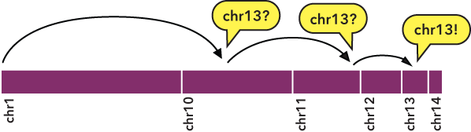

Efficiently creating Starch-formatted archives with a cluster
=============================================================

In this example, we demonstrate how to use `bedextract`_ and `starchcat`_ to efficiently generate Starch-formatted archives from BED datasets.

===================
BEDOPS tools in use
===================

For this script, we use `bedextract`_ to quickly build a list of chromosomes in an input BED dataset and extract records for each chromosome to separate files. We then use `starch`_ to compress each per-chromosome file and `starchcat`_ to concatenate per-chromosome Starch archives into one file.

======
Script
======

Two versions of the ``starchcluster`` script are included with the source and package distributions of BEDOPS (see :ref:`Installation <installation_instructions>` for more detail). 

One version makes use of an `Oracle Grid Engine <http://en.wikipedia.org/wiki/Oracle_Grid_Engine>`_ (or Sun Grid Engine) cluster environment to distribute per-chromosome tasks, while the other script uses `GNU Parallel <http://www.gnu.org/software/parallel/>`_ to split the workload over hosts running SSH. 

==========
Discussion
==========

Whole-genome analyses are often "`embarassingly parallel <http://en.wikipedia.org/wiki/Embarrassingly_parallel>`_", in that per-chromosome computations can be placed onto separate work nodes, with results collated at the end in "`map-reduce <http://en.wikipedia.org/wiki/MapReduce>`_" fashion.

If we want to filter any BED file to retrieve elements from a specific chromosome (say, to compress a BED file, one chromosome at a time), to arrange this kind of analysis, one trivial |---| but very slow |---| way to do this involves sequentially walking line by line through the file to parse and test each element. This can take a while to do. 

However, just as BEDOPS tools use the information in :ref:`sorted data <sort-bed>` to apply efficient set and statistical operations, we can use this same information to jump quickly through our data of interest.

Specifically, sorting allows us to perform a `binary search <http://en.wikipedia.org/wiki/Binary_search_algorithm>`: 

1. We jump to the middle byte of the BED file, stream to the nearest element, then parse and test the chromosome name. 
2. Either we have a match, or we jump to the middle of the remaining left or right half (decided by dictionary order), parse and test again. 
3. We repeat steps 1 and 2 until we have matches that define the bounds of the target chromosome.

To indicate the kind of speed gain that the `bedextract`_ tool provides, in local testing, a naïve listing of chromosomes from a 36 GB BED input using UNIX ``cut`` and ``uniq`` utilities took approximately 20 minutes to complete on a typical Core 2 Duo-based Linux workstation. Retrieval of the same chromosome listing with ``bedextract --list-chr`` took only 2 seconds (cache flushed |---| no cheating!).

.. _bedextract: ../reference/set-operations/bedextract.html
.. _starchcat: ../reference/file-management/compression/starchcat.html
.. _starch: ../reference/file-management/compression/starch.html
.. |--| unicode:: U+2013   .. en dash
.. |---| unicode:: U+2014  .. em dash, trimming surrounding whitespace
   :trim: